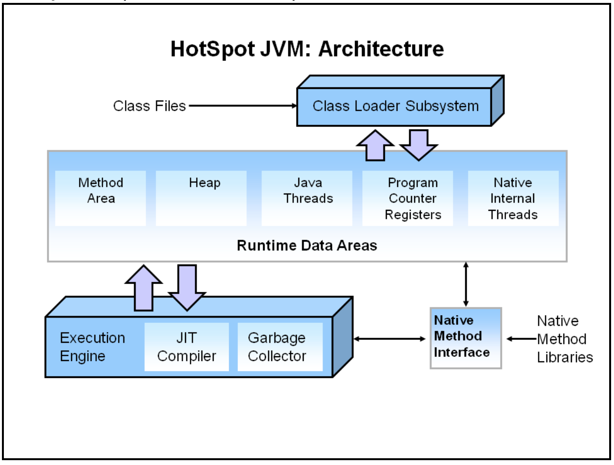
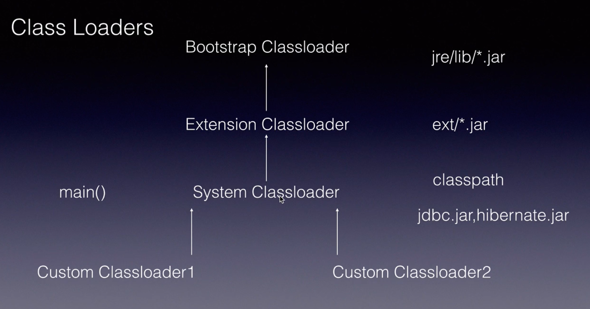
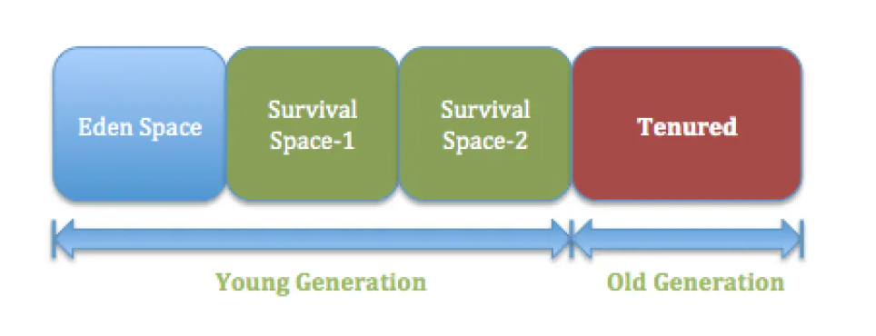
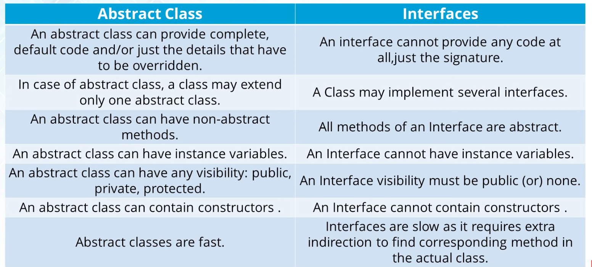
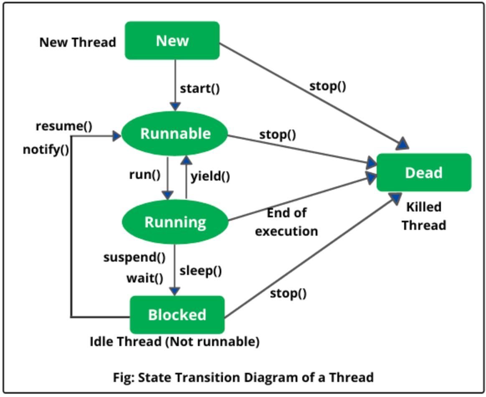
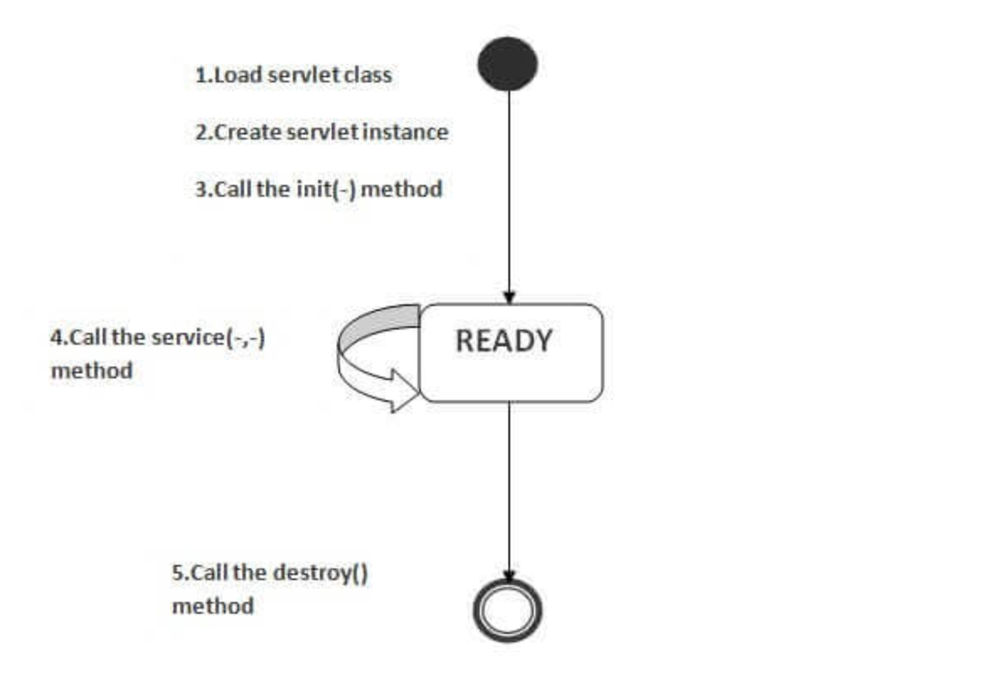

#Interview Preparation
## Java 8
- Refer: https://www.journaldev.com/2389/java-8-features-with-examples
### forEach() method in Iterable interface
- Iterator whose whole purpose is to iterate over and then we have business logic in a loop for each of the elements in the Collection
- Java 8 has introduced forEach method in **java.lang.Iterable** interface so that while writing code we focus on business logic only. 
- forEach method takes **java.util.function.Consumer** object as argument, so it helps in having our business logic at a separate location that we can reuse.
- replaces while(iterator.hasNext()) logic which may cause mismatch during iteration.
        
        //traversing using Iterator
        Iterator<Integer> it = myList.iterator();
        while(it.hasNext()){
        	Integer i = it.next();
        	System.out.println("Iterator Value::"+i);
        }
        		
        //traversing through forEach method of Iterable
        myList.forEach(element -> {
        	System.out.println("forEach element Value::"+element);
        }); 
- For loop Vs Enhanced for loop.
        
### default and static methods in Interfaces
- forEach() is example of this, but it may occur **Diamond Problem** 
    - Here implementation class will throw compile time exception as - A default method cannot override a method from java.lang.Object
    - Solution to this is we will have to provide implementation logic in the class implementing the interfaces.
- Since any class implementing an interface already has Object as a superclass, if we have equals(), hashCode() default methods in the interface, it will become irrelevant. That’s why for better clarity, interfaces are not allowed to have Object default methods.
- **Default Methods**
    - Java 8 interface default methods will help us in avoiding utility classes, such as all the Collections class method can be provided in the interfaces itself.
    - One of the major reason for introducing default methods in interfaces is to enhance the Collections API in Java 8 to support lambda expressions.
    - Java interface default methods are also referred to as Defender Methods or Virtual extension methods
- **Static Methods**
    - Java interface static method is visible to interface methods only
    - We can’t define interface static method for Object class methods, we will get compiler error as “This static method cannot hide the instance method from Object”.
- **Examples**
    - Iterable -> forEach()
    - Comparable -> comparing(), thenComparing()
    
### Functional Interfaces and Lambda Expressions
- java.util.function
- An interface with exactly one abstract method
- @FunctionalInterface annotation - This not only clearly communicates the purpose of this interface, but also allows a compiler to generate an error if the annotated interface does not satisfy the conditions.
- Note that instances of functional interfaces can be created with lambda expressions, method references, or constructor references.
- Lambda expression in itself is an anonymous method i.e. a method with no name which is used to provide implementation of the method defined by a functional interface.
- No runtime benefit of Lambda expression - only reduces boilerplate code.
        
            Runnable r = new Runnable(){
        			@Override
        			public void run() {
        				System.out.println("My Runnable");
        			}}; 
        	
        	This can be defined as in single line with the help of anonymous classes - 
        	    Runnable r1 = () -> System.out.println("My Runnable");
        
    - **Function**      
        - Represents a function that accepts one argument and produces a result.
        - Methods
            - **default <V> Function<T,V>	andThen(Function<? super R,? extends V> after)**
              Returns a composed function that first applies this function to its input, and then applies the after function to the result.
            - **R	apply(T t)**
              Applies this function to the given argument.
            - **default <V> Function<V,R>	compose(Function<? super V,? extends T> before)**
              Returns a composed function that first applies the before function to its input, and then applies this function to the result.
            - **static <T> Function<T,T>	identity()**
        
        - **Example**
            
                Function<Integer, Integer> times2 = e -> e * 2;
                Function<Integer, Integer> squared = e -> e * e;  
                
                Integer result = times2.apply(10)
                  
                times2.compose(squared).apply(4);  
                // Returns 32
                
                times2.andThen(squared).apply(4);  
                // Returns 64        

            - https://www.deadcoderising.com/2015-09-07-java-8-functional-composition-using-compose-and-andthen/

    - **Consumer**
        - Represents an operation that accepts a single input argument and returns no result.
        - Methods
            - void accept(T t)
            - default Consumer<T> andThen(Consumer<? super T> after)
            
    - **Supplier**
        - Represents a supplier of results.
        - Methods
            - T get()
            
    - **Predicate** It is an Functional Interface which allows only one Abstract method **test(T t)** within the Interface scope.
            - Methods
                - static  Predicate isEqual(Object targetRef)
                - default Predicate and(Predicate other)
                - default Predicate negate()
                - default Predicate or(Predicate other)
                - test()
                
            - Example:
                
                       // Creating predicate 
                         Predicate<Integer> greaterThanTen = (i) -> i > 10; 
                         Predicate<Integer> lowerThanTwenty = (i) -> i < 20;  
                             
                       // Calling Predicate method 
                         boolean result = greaterThanTen.and(lowerThanTwenty).test(15); 
                         boolean result2 = greaterThanTen.and(lowerThanTwenty).negate().test(15); 
                 
                 - https://www.geeksforgeeks.org/java-8-predicate-with-examples/
        			
### Java Stream API
- To avoid external iteration over collections and object containers in Java.. Stream API introduce internal iteration facility to operate on data structures in Java 8.    
        
        **Example:**
        private static int sumIterator(List<Integer> list) {
        	Iterator<Integer> it = list.iterator();
        	int sum = 0;
        	while (it.hasNext()) {
        		int num = it.next();
        		if (num > 10) {
        			sum += num;
        		}
        	}
        	return sum;
        }
        
        Following is the optimized way to write above logic using streams
       
        private static int sumStream(List<Integer> list) {
            1 7 40 97 2
        	return list.stream()
        	    .filter(i -> i > 10)
        	    .mapToInt(i -> i)
        	    .sum();
        }
      - When we want to represent group of          
- It provides several features such as sequential and parallel execution, filtering based on the given criteria, mapping etc.
- We use Streams with following:
    - **Streams with Collections**
        - A collection is an in-memory data structure to hold values. Whereas a Java Stream doesn’t store data, it is computed on-demand.
        - Java Stream doesn’t store data, it operates on the source data structure (collection and array) and produce pipelined data that we can use and perform specific operations.                                                                     
        - lazy-seeking 
            - Java Streams are lazy because intermediate operations will not be executed until the Terminal operations are executed. Each intermediate operation creates new stream.The moment we invoke terminal operation the elements will traverse otherwise nothing will happen. Thst's why streams are called lazy 
            - filtering, mapping, or duplicate removal can be implemented lazily, allowing higher performance and scope for optimization.
            - Refer - https://www.youtube.com/watch?v=xadZCQpQofY
            
    - **Streams with Functional Interfaces**
        - Function & Bi-Function - map(), mapToInt(), reduce(), toArray()
        - Predicate and BiPredicate - filter(), anyMatch(), allMatch()
        - Consumer and BiConsumer - peek(), forEach(), forEachOrdered()
        - Supplier - generate(), collect()
        
    - **Streams with Optional Class (Object container)**
        - Java Optional is a container object which may or may not contain a non-null value.
        - Methods - reduce(), min(), max(), findFirst(), findAny()
            
    - **Streams with Splitrator** 
        - used for traversing and partitioning sequences, used for parallel processing as well. 
        - **tryAdvance()** takes a Consumer that’s used to consume elements of the Spliterator one by one sequentially
            
                spliterator.tryAdvance(a -> a.setName(article.getName().concat("- published by @mm")))
                            
        - **trySplit()** split it into two parts. Then the caller process elements, and finally, the returned instance will process the others, allowing the two to be processed in parallel.
                
                public static List<Article> generateElements() {
                    return Stream.generate(() -> new Article("Java"))
                      .limit(35000)
                      .collect(Collectors.toList());
                }
               
               1, 2, 3 , 4,....1000 
               Spliterator<> sp1 = list.splitarator(); 
               
               sp2= sp1.trySplit();
               
               sp1 -> 1...500
               sp2 -> 501.. 1000
               
               sp3 = sp2.trySplit()
               
               sp2 -> 501 ..750 
               sp3 -> 751... 1000

                @Test
                public void givenSpliterator_whenAppliedToAListOfArticle_thenSplittedInHalf() {
                    Spliterator<Article> split1 = Executor.generateElements().spliterator(); 
                    Spliterator<Article> split2 = split1.trySplit(); 
                    
                    assertThat(new Task(split1).call()).containsSequence(Executor.generateElements().size() / 2 + ""); 
                    assertThat(new Task(split2).call()).containsSequence(Executor.generateElements().size() / 2 + ""); 
                }
                
        - estimatedSize() gives us an estimated number of elements
        - hasCharacteristics()
           - SIZED – if it's capable of returning an exact number of elements with the estimateSize() method
           - SORTED – if it's iterating through a sorted source
           - SUBSIZED – if we split the instance using a trySplit() method and obtain Spliterators that are SIZED as well
           - CONCURRENT – if source can be safely modified concurrently
           - DISTINCT – if for each pair of encountered elements x, y, !x.equals(y)
           - IMMUTABLE – if elements held by source can't be structurally modified
           - NONNULL – if source holds nulls or not
           - ORDERED – if iterating over an ordered sequence
               
- Java Stream Intermediate and Terminal Operations
    - filter(), map() are the most commonly used intermediate operations
    - Terminal operations that returns a result or produce a side effect.
    - Once the terminal method is called on a stream, it consumes the stream and after that we can’t use stream.
    - forEach(), toArray(), min(), max(), findFirst(), anyMatch(), allMatch() are terminal 
     
    - reduce()
        - A reduction is a terminal operation that aggregates a stream into a type or a primitive.
        - reduction stream operations allow us to produce one single result from a sequence of elements
        - The Key Concepts: Identity, Accumulator, and Combiner
        - Examples
            
                List<Integer> numbers = Arrays.asList(1, 2, 3, 4, 5, 6);
                int result = numbers
                 .stream()
                 .reduce(0, (subtotal, element) -> subtotal + element);
              
                List<String> letters = Arrays.asList("a", "b", "c", "d", "e");
                String result = letters
                .stream()
                .reduce("", (partialString, element) -> partialString + element);
              
    - peek()
        - This method exists mainly to support debugging, where you want to see the elements as they flow past a certain point in a pipeline
        - peek() can be useful in another scenario: when we want to alter the inner state of an element. 
        - For example:
                
                Stream.of("one", "two", "three", "four")
                  .filter(e -> e.length() > 3)
                  .peek(e -> System.out.println("Filtered value: " + e))
                  .map(String::toUpperCase)
                  .peek(e -> System.out.println("Mapped value: " + e))
                  .collect(Collectors.toList());
                  
                Stream<User> userStream = Stream.of(new User("Alice"), new User("Bob"), new User("Chuck"));
                userStream.peek(u -> u.setName(u.getName().toLowerCase()))
                  .forEach(System.out::println);
                
- Java Stream Short Circuiting Operations
    - An intermediate operation is called short circuiting, if it may produce finite stream for an infinite stream.
      Eg. limit() and skip()
    - A terminal operation is called short circuiting, if it may terminate in finite stream for infinite stream.
      Eg.  anyMatch(), allMatch(), noneMatch(), findFirst() and findAny()

- Java Stream skip() vs limit()
    - skip()
        - skip(n) method is an intermediate operation that discards the first n elements of a stream
        - skip() is a stateful operation.
    - limit()        
        - intermediate operation that returns a stream not longer than the requested size.
        - limit() is a short-circuiting operation.
    - Combining skip() and limit()
        - To get data in batches (paging machenism can be implemented by combinig both operations)
            
- How to merge two Streams?
    - With the help of concat() method of Stream API we can merge two streams. Eg. Stream.concat(s1,s2)
    - We can have nested Stream concatenation ion order merging multiple streams. 

- Java Stream map() vs flatMap()
    - Java map() used to deal with One-To-One mapping whereas flatMap() used to deal with One-To-Many mapping
    - map() does only transformation of one input to single output. whereas flatMap() does data transformation and flattering of elements.
    - map() takes Stream<values> as input, whereas flatMap() takes Stream<Stream<values>> as input.
          
### Java Time API
- It has some sub-packages **java.time.format** that provides classes to print and parse dates and times and **java.time.zone** provides support for time-zones and their rules.
- DateTimeFormatter
- LocalDate
- LocalTime
- LocalDateTime
- Instance

### Collection API improvements
- Iterator default method **forEachRemaining(Consumer action)** to perform the given action for each remaining element until all elements have been processed or the action throws an exception.
- Collection default method **removeIf(Predicate filter)** to remove all of the elements of this collection that satisfy the given predicate.
- Collection **spliterator()** method returning Spliterator instance that can be used to traverse elements sequentially or parallel.
- Map **replaceAll(), compute(), merge()** methods.
- Coolision Resolution in case of HashMap - from Java 8, the linked lists are dynamically replaced with balanced binary search trees in collision resolution after the number of collisions in a given bucket location exceed a certain threshold.This change offers a performance boost, since, in the case of a collision, storage and retrieval happen in O(log n).
    
### Concurrency API improvements
### Java IO improvements
### Miscellaneous Core API improvements

## Java Collections
- Collection Hierarchy
    - Root Interface is Iterable & Purpose is to play with group of objects.
    - Collection interface contains multiple Sub-Interfaces to provide different features. Factors based on they are segregated 
        - Storing
        - Insertion order
        - Access/Retrival 
        - Thread Safety(Sync/Async)
    - All collection interface implementation classes implement Collection interface indirectly through Sub-Interfaces.
    - It is up to each collection to determine its own synchronization policy
    - Collection interface provides 2 Constructors -
        - No Args - Empty Collection
        - Single arg of type Collection (They can be copied from other collections)
    - UnsupportedOperationException - methods that operate on these collections throws this exception if the operation is not supported by specific collection.
    - Some unchecked exception like NullPointerException or ClassCastException are marked as optional.
    - Implementations are free to implement optimizations whereby the equals invocation is avoided, for example, by first comparing the hash codes of the two elements. (The hashCode()} specification guarantees that two objects with unequal hash codes cannot be equal.
    - Methods: 
        - size()                
        - isEmpty()
        - contains(Object o)
        - iterator()
        - toArray(): The returned array will be "safe" in that no references to it are maintained by this collection.
        - toArray(T[] a)
        
### List 
Follows insertion order. Allows multiple null elements.
- **Implementation Classes -** 
- **ArrayList**
    - Maintains Insertion Order
    - Allows Index based access to element. It implements Random Access interface so retrival is faster.
    - Dynamically resizes by 50%
    - Non Synchronised
    - Why it is costly to have insertion and deletion in middle of ArrayList? shifting
    - 3 constructors (default, with initial capacity, collection from other)    
    
- **LinkedList**
    - Maintains Insertion Order
    - Implements List and Dequeue (FIFO approach to remove element)
    - Does not allow Index based access to element (Random access) - need to use ListIterator to iterate over elements.
    - Non Synchronised
    - When insertion and deletion operations are frequent then we can use LinkedList
      
- **Vector**
    - Synchronised
    - Dynamically resizes by doubling.
    - Maintains Insertion Order
    - Extends Stack - LIFO
    
    Collection - 1 2 3 4
    create enum 1 2 3 4 - read only copy for iteration
    Add element to collection 1 2 3 4 5
     
- **ArrayList vs LinkedList** 
    - https://beginnersbook.com/2013/12/difference-between-arraylist-and-linkedlist-in-java/
    - searching
    - Deletion
    - Insert Performance
    - Memory overhead
     
### Set
Only one null allowed.

**Sub Interfaces -**
- **SortedSet**
    - All elements must implements Comparable interface as it stores elements in ascending order.
    
**Implementation Classes -**    
- **HashSet**
    - Implements HashMap
    - Stores only unique elements
    - Unordered collection. 
    
    1 2 3 4
    
    add(5)
    
    put(5, PRESENT);
    
    HashMap
    1, PRESENT
    2, PRESENT
    3, PRESENT
    4, PRESENT
    
- **LinkedHashSet**
    - No duplicate values
    - Insertion order maintained
    - Permits null value
    - Implements Set interface, extends HashSet class
    - Non Synchronised
    - Uses Doubly Linked List
    - Default Initial Capacity 16 & Load Factor 0.75
    - Constructors
        - LinkedHashSet h = new LinkedHashSet();
        - LinkedHashSet h = new LinkedHashSet(int initialCapacity);
        - LinkedHashSet h = new LinkedHashSet(int initialCapacity, float loadFactor);
    
- **TreeSet**
    - Implements SortedSet
    - uses Tree at back end 
    - self balanced Binary Search Tree
    - Stores elements in ascending order.

- **Comparison**
    - https://www.geeksforgeeks.org/difference-and-similarities-between-hashset-linkedhashset-and-treeset-in-java/
    - **When to use**
        - If you don’t want to maintain insertion order but want store unique objects -> HashSet
        - If you want to maintain insertion order of elements then you can use LinkedHashSet	
        - If you want to sort the elements according to some Comparator then use TreeSet.
### Queue

**Sub Interfaces -**
- **DeQue**
    - Double ended queue where elements can be inserted and deleted from both ends.

**Implementation Classes -**   
- **PriorityQueue**
    - Elements are stored and served as per the priority of the element irrespective of their insertion order.
    - How it sets the priority of specific element in Queue?
    - PriorityQueue doesn’t permit null.
    
- **ArrayDeQue**
    - This is an only implementation of DeQue.
    - In addition, it's a resizable array with no capacity restrictions.

### Map

- Why Map is not part of collection Hierarchy ?
- Hetrogeneous objects are not allowed in TreeSet  and TreeMap

**Sub Interfaces -**
- **SortedMap**
    - Entries are maintained by an ascending key order
    
**Implementation Classes -**    
- **HashMap**
    - Non Synchronised 
    - Allows only one null key but multiple null values (because keys are always unique)
    - uses hashcode() and equals() method for put and get the elements from map, Also applies collision resolution technique.
    
- **HashTable**
    - Synchronised
    - Does not allow any null key or values
    
- **TreeMap**
    - Implements SortedMap
    - Implicitly implements Red-Black tree implementation
    - Can't store any null key

### Questions
- Why map doesn't extend the Collection interface?
   - Both are different in structural manner. Key-pair Vs Object. Add(obj) Vs Put(k,v)

- What is difference between fail-fast and fail-safe Iterators?
     - **fail-fast** It throws ConcurrentModificationException - In case of modification of non sync collections by multiple threads.
     - **fail-safe** It operates on a clone of Collection so doesn't throw an Exception.
     - Here basically iterators iterate over thread safe collections like Vectors, ConcurrentHashMap's etc. are fail-safe others are fail-fast which throws ConcurrentModificationException

- Every collection implemnts clonable and serializable 
     
- Map Vs IMap 
    
    - IMap - This class is used when the user requires the objects to be compared via reference. It belongs to java.util package.
    - Use case where we use IMap
    
- What is the usage of BlockingQueue

- What is difference between Synchronous collection and concurrent collection?

### Synchronized Collections
- **synchronizedCollection()**
- **synchronizedList()**
- **synchronizedMap()**
- **synchronizedSortedMap()**
- **synchronizedSet()**
- **synchronizedSortedSet()**

### Concurrent Collections
- **ConcurrentHashMap**
    - Constructor args    
        - Concurrency-Level - It is the number of threads concurrently updating the map. The implementation performs internal sizing to try to accommodate this many threads.
        - Load-Factor - It’s a threshold, used to control resizing.
        - Initial Capacity - Accommodation of a certain number of elements initially provided by the implementation. if the capacity of this map is 10. It means that it can store 10 entries.
        - default initial capacity (16), load factor (0.75) and concurrencyLevel (16).
    - Methods
        - put()
        - putAll()
        - remove()
        - clear() 
        - get()
        
- **CopyOnWriteArrayList**
    - an enhanced version of ArrayList in which all modifications (add, set, remove, etc) are implemented by making a fresh copy
    - thread-safe version of ArrayList
    - **Iterator** - When we create an iterator for the CopyOnWriteArrayList, we get an immutable snapshot of the data in the list at the time iterator() was called.
        - The Iterator of CopyOnWriteArrayList can't perform remove operation otherwise we get Run-time exception saying UnsupportedOperationException. 
        - Also Iterator of CopyOnWriteArrayList will never throw ConcurrentModificationException.

## Optional in Java
- Optional API used to encapsulate the value.
- Why do we need this? Because it helps us to avoid NullPointerException at the Runtime & also makes the code very clean.
       
       // Without Optional
        private static String codeWithoutOptional(String property){
            String value = System.getProperty(property);
            if(value == null){
                value = System.getenv(property);
            }
            if(value != null){
               return value;
            }  
            throw new IllegalArgumentException("" + property + "property not valid");
        }
        
        // With Optional
        private static String codeWithOptional(String property, String defaultVal){
            Optional
                .ofNullable(System.getProperty(property))
                .orElse(defaultVal);
        }
        
- Three ways to create an Optional 
    - Optional.empty()
    - Optional.of()
    - Optional.ofNullable()    
    
- Benefits 
    - Null check not required
    - No more NullPointerException
    - Clean and neat API's
    - No more boiler plate code.
         
- A container object which may or may not contain a non-null value. 
- If a value is present, **isPresent()** will return **true** and **get()** will return the value.
- Provides following methods
    - of()
    - ofNullable()
    - map()
    - filter()
    - empty()
    - isPresent()
    - ifPresent()
    - orElse()
    - orElseThrow()
    
# Interview discussion with Akhand (27 Jan 2021)

### Core Java
- JVM & Architecture
    - JVM stands for Java virtual machine
    - JVM is the virtual machine on which java code executes.
    - JVM is responsible for converting byte code into machine specific code.   
       
    - What is JVM ClassLoader Subsystem? Types of ClassLoaders 
        - Class loader loads, links, and initializes a class from a Java class file.
        - Types:
            
            - Bootstrap
                - At the top of the hierarchy is the bootstrap class loader. 
                - This class loader is responsible for loading only the classes that are from the core Java™ API like java.lang, java.util etc
                - It loads all classes inn jre/lib/*.jar
                
            - Extensions
                - The extensions class loader can load classes that are standard extensions packages(JAVA_HOME/jre/lib/ext) in the extensions directory.
                
            - System
                - Load classes from the local file system, and will load files from the CLASSPATH. 
                - It is the parent of any custom class loader or hierarchy of custom class loaders.
                
            - Custom class loaders
        - ClassNotFoundException
        - Another way to load classes during runtime :
            
                Class driver = Class.forName("com.mysql.jdbc.Driver");
            
        - Namespaces and the runtime package
            - A namespace is a set of class names that are loaded by a specific class loader. 
            - the delegation model prevents the possibility of replacing a trusted class with a class of the same name from an untrusted source.    

    - Heap Area in JVM
              
         - Heap stores all the objects and arrays that are created by the java program.
         - Heap is divided into two generations: 
            - The Young Generation 
                - We can set the size of Young Generation by using -Xmn option in VM args.
                - Further divided into two spaces: Eden Space and Survivor Space
                        
            - The Tenured(Old) Generation.    
                - Depending on the threshold limits by age, objects are moved from the Survivor spaces to the Tenured space.
                - Major GC runs in the tenured area.   
    
    - Method Area(Non-Heap Area)
           
        - Permanent Generation 
            - This area stores class related data from class definitions, structures, methods, field, method (data and code) and constants. 
            - Can be regulated using -XX:PermSize and -XX:MaxPermSize. 
            - It can cause java.lang.OutOfMemoryError when it runs out space.
        - Code Cache
            - The JIT(Just in Time) compiler compiles the bytecode to native code. This native code is stored in the code cache area.
            - We can increase the code cache size using –XX:ReservedCodeCacheSize.              

    - Garbage Collector(GC) in Java
       - It is a process of recycling heap memory by acquiring memory from unused objects  
       - When an Object becomes Eligible for Garbage Collection?
            - An object which is not reachable from any live threads or by any static references.
            - Cyclic dependencies are not counted as reference
       - JVM provides four options for us to select the apt Garbage Collector for our Application.
            - Serial Garbage Collector
                - It uses a single thread for Garbage Collection.As a result, this freezes all application threads when it runs.
                - Add -XX:+UseSerialGC in JVM args to set this GC explicitly.
                
            - Parallel Garbage Collector
                - It uses multiple threads to scan through the heap space
                - It is best suited if applications that can handle such pauses, and try to optimize CPU overhead caused by the collector.
                - Also known as Throughput collector.
                - Add -XX:+UseParallelGC in JVM args to set this GC explicitly.
                - Parallel GC is the default garbage collector in JDK 8.
                
            - CMS(Concurrent Mark Sweep) Garbage Collector
                - It mark objects that are unused and then sweep the marked objects.
                - CMS collector uses more CPU to ensure better application throughput as compare with Parallel GC.
                - Add –XX:+USeParNewGC in JVM args to set this GC explicitly.
                
            - G1 Garbage Collector
                - It is designed for applications running on multi-processor machines with large memory space. Basically it is mainly designed for an application having heap size greater than 4GB.
                - G1 collector partitions the heap into a set of equal-sized heap regions, each a contiguous range of virtual memory 
                - G1 Garbage Collector is the default garbage collection of Java 9.
                - The biggest advantage of the G1 GC is its performance. It is faster than the other 3 GC types.
                - Add -XX:+UseG1GC in JVM args to set this GC explicitly.
    
    - Java 8 : Metaspace
        - With Java 8, Permanent Generation(PermGen) has been removed and is replaced with Metaspace.
        - PermGen can cause java.lang.OutOfMemoryError when it runs out if space.
        - A new flag is available (MaxMetaspaceSize), allowing you to limit the amount of native memory used for class metadata.                             
        
- Constructors in Java
    - **Def**: It is a special method used to initialize the objects at the time of instantiation.
    - **Return type**: void
    - **Types**: 
        - Default - 
        - Parameterized 
        - Copy
    - **Constructor chaining**
        - process of calling one constructor from another constructor in the context of same object
        - In case of inheritance
        - this keyword should be the first line in calling constructor or else it will not work
        - they can be executed in any order
        - we are doing chanining because we want to initialize values
        - Is there any other way we can achieve chaining? Java provides **IIB** features {} during class load this is called before constructor.
        
    - Copy Constructor vs. Clone
        - The copy constructor has some advantages over the clone method:
            - In copy constructor we don't need to implement the Cloneable interface and handle CloneNotSupportedException.
            - The clone method returns a general Object reference. Therefore, we need to typecast it to the appropriate type.
            - We can not assign a value to a final field in the clone method. However, we can do so in the copy constructor.
        - Issues with Inheritance - we will face a casting issue -> ClassCastException        
    
    - Deep Copy & Shallow Copy
       - Shallow copy copies the existing references of object - we can do with default clone()  method  
       - Deep copy we create new instance and then copy the values.
       - object cloning 
          - The java.lang.Cloneable interface must be implemented by the class whose object clone we want to create. 
          - If we don't implement Cloneable interface, clone() method generates CloneNotSupportedException. 
          - The clone() method saves the extra processing task for creating the exact copy of an object.        
             
- What is Exception in Java? Exception Hierarchy in Java
    - **Defin** - Exception is nothing but handling the execution flow and handling error's so the flow should not terminate normally 
    - **Hierarchy** - subclasses of java.lang.Throwable class - split into Exception & Error
    - **Error** - Errors are abnormal conditions, Errors belong to unchecked type and mostly occur at runtime. Eg. OutOfMemory, StackOverflow
    - **Exception** - IO, ClassNotFound, RuntimeException - NullPointer, Arithmetic
    - **Checked** -  known to the compiler at compile time. Eg. SQLException,IOException
    - **Unchecked** exceptions like ArrayIndexOutOfBoundException known to the compiler at runtime. Eg. NullPointerException, ArithmeticException. 
    - **Exception Handling** - try, catch, finally, throw(throw an exception), throws(declare in a method - so consumer will get informed)
    - Pipe feature in Exception catch
    - **try with resources** here we can remove finally block - and use this feature of Java 7 - where resources that implements AutoClosable interface are enclosed in that block.  
    - Exception Handling in spring - **ControllerAdvice**  - extends ResponseEntityExceptionHandler
    - Without exception handling there is no java exception
    - **I18n** - Custom exception handling - how we can include Internationalization in that 
        - ResourceBundleMessageSource - picks property file contains exception messages
    
- What is HashMap?
    - Implementation of Map - deals with (k,v) pairs 
    - default size 0-15
    - it can be used in non multithreaded environment
    - hashmap keys should be immutable - String is mostly used as a key.
    - We can create Custom key - should be immutable object - should implement hashcode(), equals() (Not mandatory)
    - Hash-collision - Java7 - LinkedList, Java8 - Binary Search Tree
    - ConcurrentModificationException - solution is SynchronizedMap - but still has performance issue
    - ConcurrentHashMap(initlimit,loadfactor, concurrency) 
    - Rehashing - when hash map reaches to loadFactor then rehashing happens.
    - Resizing of hash map will lead you to race condition 
    
- What is Immutable class? How will you create?
    - will make class as final so no one can extend
    - create variables as final- initialzied during instantiation.
    - expose only getter methods.
    - If want to update then instantiate new object. 

- What is transient & volatile
    - transient 
        - variables doesn't take part in serialization & deserialization
        - we can't mark it as final
        - deserialization set's default value for that var's
        
    - volatile 
        - used in multithreaded env. 
        - When we have 2 threads r/w simultaneously. 
        - used where we need most recent value 
        - stored directly in main memory 
        
- Serialization & Deserialization -
    - Serializable is a marker interface
    - It is a process of converting java object into byte stream so that we can easily transfer it over network and store in files.
    - SUID - serialVersionUID - here class name, sorted member names, modifiers, interfaces to SHA to compute hash value. This is further used to match with existing obj during deserialization, if not match then it throws InvalidClassException
    - Compatible changes vs Incompatible changes in serializable class 
                  
                  private static final Long serialVersionId = 123456L;
                  
       - Advantage of this statement - If we make any compatible change in serializable class then we don't need to recompile and deploy - it will work
       - If we don't provide this statement then we must have to recompile and redepoly class
       - For any non compatible change we must have to recompile and redeploy the code.   
       - java.io.InvalidClassException              
    - Other ways to make object Serializable
        - use Externalizable -> writeExternal(), readExternal()
        - XML serialization
        - roll-your-own - write content directly via ObjectOutputStream & DataOutputStream 
                  
- I have an ArrayList of Employee - has 5 vars - I want to sort list by name, age, salary
   - Comparable 
        - The main purpose of the Comparable interface is to enable the natural sorting of elements grouped in collections or arrays.
        - A comparable object is capable of comparing itself with another object. 
        - The class itself must implements the java.lang.Comparable interface to compare its instances. 
        - provides me single sorting 
        - has drawback is we have to modify existing class by overriding compareTo() 
        - Collectios.sort(list)
        - here we compare with current instance
        - TreeMap and TreeSet are two implementations from the Java Collections Framework are the real time implementation of Comparable Interface
        
   - Comparator
        - we need to create custom comparator 
        - implement comparator's compare()
        - java.util
        - Collectios.sort(list, Comparator)
        - here we pass two instances
   
   - all above is Java 7 - java 8 provides with streams           
  
- OOP's in Java                                                                                                                                                                                                                                                                                                                                                                                                        - What is OOP's concept?
    - Abstraction : What is the difference between Abstract class, Abstraction, Interface?
        - These all deals with abstraction, It is a way to achieve abstraction in Java. We are hiding implementation details, and showing functionality. Focus on what instead of how.
        - There are levels of abstraction-
        - Abstract class Vs Interface 
            
            - **Type of methods**: Interface can have only abstract methods. Abstract class can have abstract and non-abstract methods.
            - **Final Variables**: Variables declared in a Java interface are by default final. An abstract class may contain non-final variables.
            - **Type of variables**: Abstract class can have final, non-final, static and non-static variables. Interface has only static and final variables.
            - **Inheritance vs Abstraction**: A Java interface can be implemented using keyword “implements” and abstract class can be extended using keyword “extends”.
            - **Accessibility of Data Members**: Members of a Java interface are public by default. A Java abstract class can have class members like private, protected, etc.
            - **When to use** Interfaces are used to achieve 100%  abstraction(loose coupling) while Abstract classes are used where we have to implement default functionality(code reusability)
            - **Speed** Abstract classes are faster than interfaces.
            - Can i create instance of abstract class? No -> What is the way if i want to create instance? adding main method inside
            - **Object To Object Inheritance**
                - In Abstract classes object of class created at runtime we can not create it explicitly from code. Extending abstract classs and provide implementation of abstract methods called object to object inheritance.
                - In Interface neither we nor runtime env can create the object - so this is not Object to Object inheritance
        - Can we create instance of abstract class? How abstract class constructor invoked?
        - Can we make abstract class as final?
                      
    - Encapsulation - coupling method and variables as asingle unit
    - Inheritance
        - Is-A relationship - parent-child - heavily used in OOP 
        - Code reusability, provides overriding
        - levels of inheritance - single, multilevel, hybrid, 
        - There will be compile time error in this issue - diamond problem - resolved using implementing multiple inheritance
        - Child methods that are overriding parent should have higher or equal access specifier, we can not reduce the access level.
        - What is multiple inheritance and does java support it?
            - Here child class inherits properties from multiple parent classes which is not allowed in Java, Here this is achieved with the help of Interfaces.
            - So to overcome Dimond problem in Multiple Inheritance we use interfaces for multiple inheritance.
            - Since Java 8 there are static and default methods allowed in interfces which may cause this problem again.
                   
    - Polymorphism
        - compile time
            - overloading - static binding - early binding - single class only     
        - runtime  
            - overriding - dynamic binding - late binding - inheritance multiple classes
        - Can we override private or static method in Java?
            - No we can't since private is not accessible or visible in other class whereas static is linked to class. We can create static method in child to override parent static method - it should be same that is called hiding

- Collections        
     - Introdudction
     - Iterable root interface 
     - Collection
        - generic collection vs non generic collection
        - List
            - ArrayList - non synchronized
                - ways to remove element 
                    - remove() from List - remove(index), remove(object) 
                    - remove() from Iterator interface remove() - slow performance
                - CopyOnWriteArrayList 
                    - works on clone of object    
            - LinkedList
                - maintains order of insertion
                - non sync
                - faster in case of insertion, deletion
            - Vector
                - sync
                - slow as compare with 
                - LIFO - push, pop
            - where you will use List - insertion, deletion, access
        
        - Queue
            - FIFO
            - PriorityQueue - don't allowed
            
        - Set
            - insertion order followed
            - duplicate not allowed - override 
            - allows only one null - always null at 0th index of set
            - Set initialization - we should create implementation of interface 
            - HashSet
                - always unique
                - Iterator
            - LinkedHashSet
                - maintains insertion order
            - TreeSet
                - ascending order 
            - SortedSet
                - gives natural order of sorting
            - Can u explain me TreeSet, HashSet, 
            - Can u explain me collection with three
            - Can u remove from list? How?
            
     - Map
        - LinkedHashMap vs HashMap vs TreeMap
        - We can't traverse over map - need to convert keySet or entrySet.
        - generic 
            
     - Collections Vs Stream
         - Stream will not modify source it operates on source and 
         - Stoarage is fixed - not finalized in Stream
        
     - Generic comes from Java 5   
    
- Thread
    - States of thread - new , runnable, terminated, waiting, blocked, timed waiting. 
    - Thread Lifecycle
        
        - init()
        - runnable -> Thread.start() - executes run()
            - thread schedular -> time slice given to execute specific thread otherwise thrread will get blocked
        - blocked state - whenever thread is waiting for other source, and thread then it goes to blocked state. from here thread can only go to runnable
        - waiting state - wait() then it goes to runnable
        - timed waiting - 
        - terminated - after task completion
        - Thread Constants
        
        
        
    - What is difference between wait, sleep, yeild ?     
        - wait always called on Object class - for the purpose of Interthread Communication
        - sleep, yeild are from Thread class
        - yeild - it releases CPU hold and gives to other - resume from this state only depends on scheduler.
        - sleep resumes after specific time, wait needs explicitly resume.

- String
    - The String is immutable in Java because of the security, synchronization and concurrency, caching, and class loading. 
    - The reason of making string final is to destroy the immutability and to not allow others to extend it.
    - The String objects are cached in the String pool, and it makes the String immutable.
    - this is immutable, final class provided by Java, lang package
    - It is not an primitive type
    - It is thread safe
    - JVM has special arrangement - String pool in heap
    - How to create String Object?
        - use new String()
        - String litral - all those will go to String pool
    - String litral pool - when we create litral it looks in string pool for specific litral
    - intern() method - used to store objects to string pool
    - Methods
        - loweCase, upperCase, conversion toString
    - Initially switch case not allowed to use String - now from Java 7 8 allowed
    - Can we use Enum in switch case? Yes we can directly use as object instead of values of Enum, For multiple Enum we can have single code logic
    
    - String vs StringBuffer vs StringBuilder
        - all are final classes
        - String is immutable
        - StringBuffer and StringBuilder are mutable
        - StringBuffer thread Safe & StringBuilder is not thread safe
    - String also supports RegEx         
    - String is used as key in HashMap     
    
- What is boxing & unboxing?     
  - The automatic conversion of primitive data types into its wrapper class objects is known as **autoboxing**
    
         int a = 15; // Primitive data type
             Integer I = a; // Autoboxing will occur internally.
 
  - The automatic conversion of wrapper class objects into its primitive data types is known as unboxing.
    
        Integer a = new Integer(15); // Wrapper class object
              int I = a;// Unboxing will occur internally.
              
  - Wrapper Classes
    - A wrapper class in Java converts a primitive data type into class object.
    - Java is an object-oriented language that only supports pass by value. 
    - Therefore, wrapper class objects allow us to change the original passed value. 
    - These wrapper classes help with multithreading and synchronization because, in Java, multithreading only works with objects. 
    - Moreover, most collections (like Vector, LinkedList, etc.) work with objects.
 
- Singleton Design Patterns
    - When we need single instance of class in JVM then we implement this
    - How to create? 
        - Lazy Initialization 
            - create class
            - mark constructor private
            - create private static member variable of a class
            - create static getInstance method. 
                    static Object getInstance(){
                        if(obj!=null){
                            obj = new ObjClass();
                        }
                    } 
            - add synchronized keyword for thread safety
                - synchronized It is keyword provided by Java. It should be executed single thread at a time. Thread lock is there (helps to avoid race condition)
                 
       - Eager Initialization 
            - create private static member variable of a class and initialize it with new Object()
       
       - How to break Singleton Design Pattern?
            - If object is there - we can clone object - this will break Singleton design pattern
            - Object class clone() method 
            - Solution - override clone() and throw the exception CloneNotSupportedException
            - Reflection API can also break - class.forName()  
            - Deserialization will also create new instance  
       
       - Enumeration - these are checked at compile time - we can implement singleton design pattern.
             
- JDBC - Core Java    
    - It is an API to provide common platfrom to connect with Relational database.
    - Driver classes - 
        - Jdbc/Odbc, 
        - thin 
            - completely written in Java. 
        - native
    - Classes
        - DriverManager class we need to register driver, provides connection 
            - getConnection()
    - Key Interfaces 
        - Connection - It is an Factory which contains all instances of other objects
            - Database Meta Data
        - ResultSet - stores all the result
            - It's scroll sensitive - single direction - we can't update
            - What is Exhasted Result Set - exception thrown by this intrface
            - Result Set meta data - column count, column name
        - Statement 
            - Used to execute static query. 
            - vulnerable for SQL Injection
            - Used only for DDL commands
            - Gets compiled every time
        - CallableStatement 
            - Used for stored processor, 
            - It has it's own return type, Register out
        - PreparedStatement 
            - Here we can pass parameterized query 
            - Dynamic query building
            - Gets compiled once(pre compiled)
    - It provides batch processing
    - How we do TransactionManagement - programetic transaction managenment commit(), rollback()
    - ACID 
        - Atomic 
            - Either all or none.
        - Consistency 
            - Before transaction start and after transaction ends sum of the money should be same.
            - Table level lock used to achieve this 
        - Isolation 
            -  Inconsistency happens in case of parallel transactions. So we convert this to serial transactions in order to achieve isolation.
            -  Conflict Serializability & View Serializability 
        
        - Durability - we can't change once committed.
 
- How will you map your Query result's in spring? RowMappers in JDBC
    - this is with help of RowMapper
    - RowMapper is an Interface which allows us to map the rows to user defined entities. (fetches the records from DB and contains Query())
    - It iterates ResultSet and adds it to collection
    - What is the advantage over ResultSet?
        - Select * from Students
            ResultSet needs to iterate and add to collection manually
            We can create RowMapper and override **mapRows()** and will map with entity
            RowMapper used with JDBCTemplate         

- Servlets
    - Server side technology allows to serve the web requests (HTTP/HTTPS) from the client.    
    - Part of javax.servlet and javax.servlet.http packages provides support to define the servlets
    - Any servlet program should implement javax.servlet.Servlet interface which provides lifecylcle methods for servlet.
    - **Servlet Lifecycle**
    
        - init() 
            - The init method must complete successfully before the servlet can receive any requests. 
            - The servlet container cannot place the servlet into service if the init method either throws a ServletException or does not return within a time period defined by the Web server.
                
                public void init() throws ServletException {
                    // Initialization code like set up database etc....
                }
                
        - service() 
            - This method is only called after the servlet's init() method has completed successfully.
            - The Container calls the service() method to handle requests coming from the client, interprets the HTTP request type (GET, POST, PUT, DELETE, etc.) and calls doGet, doPost, doPut, doDelete, etc. methods as appropriate.
                    
                    public void service(ServletRequest request, ServletResponse response) 
                      throws ServletException, IOException {
                        // ...
                    }
        - destroy()
            - Called by the Servlet Container to take the Servlet out of service.
            - This method is only called once all threads within the servlet's service method have exited or after a timeout period has passed. After the container calls this method, it will not call the service method again on the Servlet.
            
                    public void destroy() {
                        // 
                    }
    - **Get Vs Post**
         
        - **Idempotent:** Idempotency means that multiple identical requests will have the same outcome. So it does not matter if a request is sent once or multiple times.
        - **Safe:** An HTTP method is safe if it doesn't alter the state of the server. In other words, a method is safe if it leads to a read-only operation. Several common HTTP methods are safe: GET , HEAD , or OPTIONS .
    
    - **Session Management**
        - Session is a conversional state between client and server and it can consists of multiple request and response between client and server.
        - Since HTTP and Web Server both are stateless, the only way to maintain a session is when some unique information about the session (session id) is passed between server and client in every request and response
        - Contains
            - User Auth - This is not very effective method because it wont work if the same user is logged in from different browsers.
            - Html Hidden fields - Also it’s not secure because we can get the hidden field value from the HTML source and use it to hack the session.
            - Cookies 
                - We can maintain a session with cookies but if the client disables the cookies, then it won’t work.
                - JSESSIONID Cookie - This cookie is used to identify the HttpSession object in further requests from client.  
            - URL Rewiring
            - Session management API (HttpSession)
            
    - **Servlet Context**      
       - Easy to maintain if any information is shared to all the servlet, it is better to make it available for all the servlet.
       - This is the way to provide sevlet context detials in web.xml file of servlet
                <context-param>  
                    <param-name>dname</param-name>  
                    <param-value>sun.jdbc.odbc.JdbcOdbcDriver</param-value>  
                </context-param>  
            
    - **Servlet Config**   
        - Following is the way we cconfigure servlet in web.xml
                        
                <servlet>  
                    <servlet-name>sonoojaiswal</servlet-name>  
                    <servlet-class>DemoServlet</servlet-class>  
                </servlet>  
                   
                <servlet-mapping>  
                    <servlet-name>sonoojaiswal</servlet-name>  
                    <url-pattern>/context</url-pattern>  
                </servlet-mapping>
    
    - **Request Dispatcher**
        - This forwards request to other resources or another servlet in same application            
                  
- Generics    
    - You can write a single generic method declaration that can be called with arguments of different types. 
    - Based on the types of the arguments passed to the generic method, the compiler handles each method call appropriately.
- Unit Testing    
- Inner classes
   
- Deadlock

#### Core Java By The Baeldung
- What Does the “unchecked cast” Warning Mean?
    - The “unchecked cast” is a compile-time warning. Simply put, we'll see this warning when casting a raw type to a parameterized type without type checking.
    
             Map rawMap = new HashMap();
             rawMap.put("date 1", LocalDate.of(2021, Month.FEBRUARY, 10));
             Map<String, LocalDate> castFromRawMap = (Map<String, LocalDate>) rawMap;
             
    - we should avoid using raw types. This is because using raw types will make us lose all the safety and expressiveness benefits of generics.
    - When we use the @SuppressWarning(“unchecked”) annotation, we should always put it on the smallest scope possible.

- a.getClass() Vs A.class
    - the class java.lang.Class is the entry point of all reflection operations. 
    - two different ways to get an object of java.lang.Class:
        - Calling the Object.getClass() method
           - When we call the Object.getClass() method, we get the runtime type of the str object. 
        - Using the .class syntax
           - On the other hand, String.class evaluates the String class statically.
                    
                    # In case of Inheritance:
                    
                    public class Animal {
                        protected int numberOfEyes;
                    }
                    
                    public class Monkey extends Animal {
                        // monkey stuff
                    }
                  
                 -------------------------------------------
                    
                   Animal animal = new Monkey();
                
                   Class runtimeType = animal.getClass();
                   Class staticType = Animal.class;
                   
                   # Here the output will be like :
                   staticType: com.baeldung.getclassobject.Animal
                   runtimeType: com.baeldung.getclassobject.Monkey

- (String) vs toString()
    - (String) 
        - if we know that our variable is a String instance, we should use type casting. 
        - This approach is generally more efficient and quicker because we don't need to perform additional function calls
        - This operation is null-safe. 
    - toString()
        - When we pass any other object type, we need to call the toString() method explicitly. 
        - It is important to remember that it returns a String value according to the implementation  
        - Here we could get a NullPointerException when passing a non-instantiated variable to the method

- Does a Method’s Signature Include the Return Type in Java?
    - the method signature is comprised of the name and parameter types. 
    - Therefore, all the other elements of the method's declaration, such as modifiers, return type, parameter names, exception list, and body are not part of the signature.

- How to determine if an Object is of Primitive Type?
    - The **java.lang.Class.isPrimitive()** method can determine if the specified object represents a primitive type. However,  it does not work on the wrappers for primitives.
    - Apache Commons Lang has a **ClassUtils.isPrimitiveOrWrappe** method that can be used to determine if a class is a primitive or a wrapper of primitive.
    - Guava provides a similar implementation via the **Primitives.isWrapperType** method.
  
- Why are Local Variables Thread-Safe in Java?
    - JVM splits up its available memory into stack and heap memory. 
    - Firstly, it stores all objects on the heap. 
    - Secondly, it stores local primitives and local object references on the stack  
    - **Every thread, including the main thread, has its own private stack.** Therefore, other threads do not share our local variables, which is what makes them thread-safe.    

- Collection.stream().forEach() Vs Collection.forEach()
    - Collection.stream().forEach()
        - The processing order of Collection.stream().forEach() is undefined.
        - We'll get a ConcurrentModification exception when we add or remove an element during the execution of the stream pipeline. 
        - However, the exception will be thrown later.
        
    - Collection.forEach()
        - Collection.forEach() uses the collection's iterator (if one is specified). 
        - That means that the processing order of the items is defined.
        - Since forEach() is fail-fast, we stop iterating and see an exception before the next element is processed
        
    - If we don't require a stream but only want to iterate over a collection, the first choice should be using forEach() directly on the collection.                                

- Marker Interfaces in Java
    - A marker interface is an interface that has no methods or constants inside it
    - It provides run-time type information about objects, so the compiler and JVM have additional information about the object.
    - Java has many built-in marker interfaces, such as Serializable, Cloneable, and Remote.
    - Unlike annotations, interfaces allow us to take advantage of polymorphism. As a result, we can add additional restrictions to the marker interface.    

### Spring
- What is Spring Application Container?
    - Web container responsible for managing the lifecycle of servlets.
    - Spring Application Container is IOC container that manages bean life cycle and perform dependency injection.  
    - IoC container (Inversion of Control) which receives metadata from either an XML file, Java annotations, or Java code and works accordingly
    - BeanFactory and ApplicationContext are two different IOC containers provided by Spring. 
    - **BeanFactory** 
        - Basic Interface defined in org.springframework.beans.factory.BeanFactory which provides the basic support for Dependency Injection.
        - Lazy Loading: Initially only the BeanFactory is initialized, The beans will be loaded only when we explicitly call the getBean() method.(Lightweight container)
        - Required Manual registration of processors: BeanFactoryPostProcessor, BeanPostProcessor 
        - Methods: getBean(), containsBean(), isSingleton(), isPrototype() 
        - BeanFactory only supports two scopes — Singleton and Prototype.
        - XML Configuration: XmlBeanFactory is the implementation class for the BeanFactory interface.
                
                <bean id="employee" class="com.baeldung.beanfactory.Employee">
                    <constructor-arg name="name" value="Hello! My name is Java"/>
                    <constructor-arg name="age" value="18"/>
                </bean>
                
                 BeanFactory beanFactory = new XmlBeanFactory(new ClassPathResource("beans.xml"));
                 Employee emp = (Employee) factory.getBean("employee");
                
    - **ApplicationContext**
        - It is the advanced Spring container and is built on top of the BeanFactory interface.
        - Eager-initialization hence loads all beans at startup. 
        - It provides: 
            - It extends the MessageSource interface, therefore provides internationalization functionality.
                
                    public void testInternationalization() {
                        MessageSource resources = new ClassPathXmlApplicationContext("classpathxmlapplicationcontext-internationalization.xml");
                    
                        String enHello = resources.getMessage("hello", null, "Default", Locale.ENGLISH);
                        String enYou = resources.getMessage("you", null, Locale.ENGLISH);
                        String enThanks = resources.getMessage("thanks", new Object[] { enYou }, Locale.ENGLISH);
                     
                        assertThat(enHello, equalTo("hello"));
                        assertThat(enThanks, equalTo("thank you"));
                    
                        String chHello = resources.getMessage("hello", null, "Default", Locale.SIMPLIFIED_CHINESE);
                        String chYou = resources.getMessage("you", null, Locale.SIMPLIFIED_CHINESE);
                        String chThanks = resources.getMessage("thanks", new Object[] { chYou }, Locale.SIMPLIFIED_CHINESE);
                     
                        assertThat(chHello, equalTo("你好"));
                        assertThat(chThanks, equalTo("谢谢你"));
                    }
                
            - event publication functionality
            - annotation-based dependency injection
            - easy integration with Spring AOP features
            - Automatic Registration of BeanFactoryPostProcessor and BeanPostProcessor
        - supports almost all types of bean scope    
        - The ClassPathXmlApplicationContext class is the implementation class of ApplicationContext interface.
        - Shut down the container gracefully when the application is shut down,
        
- What is IOC and Dependency Injection in Spring?
    - IOC is mechanism by which the control of objects or portions of a program is transfered to a container or framework.
    - It helps in decoupling the execution of a task from its implementation
    - Inversion of Control can be achieved through various mechanisms such as: 
        - Strategy design pattern 
        - Service Locator pattern 
        - Factory pattern
        - Dependency Injection (DI).        
            - Constructor 
                
                    @Configuration
                    public class AppConfig {
                    
                        @Bean
                        public Item item1() {
                            return new ItemImpl1();
                        }
                    
                        @Bean
                        public Store store() {
                            return new Store(item1());
                        }
                    }
                    
                   XML Based:
                    <bean id="item1" class="org.baeldung.store.ItemImpl1" /> 
                    <bean id="store" class="org.baeldung.store.Store"> 
                        <constructor-arg type="ItemImpl1" index="0" name="item" ref="item1" /> 
                    </bean>
                    
            - Setter - pass object in setter
                    
                    @Bean
                    public Store store() {
                        Store store = new Store();
                        store.setItem(item1());
                        return store;
                    }
                    
                    <bean id="store" class="org.baeldung.store.Store">
                        <property name="item" ref="item1" />
                    </bean>
                    
            - Field - @Autowiring - byName, byType - it will throw exception in case of duplicate (@Qualifier) , constructor, default
                   
                   Example:
                     @Bean(autowire = Autowire.BY_TYPE)
                   
                   byType:                
                    public class Store {
                        @Autowired
                        private Item item; 
                    }
                   
                   byName: 
                    public class Store {
                        
                        @Autowired
                        @Qualifier("item1")
                        private Item item;
                    }
            
            - Lazy Initialized Beans
                - By default, the container creates and configures all singleton beans during initialization. To avoid this, you can use the lazy-init attribute with value true on the bean configuration:
                    
                        <bean id="item1" class="org.baeldung.store.ItemImpl1" lazy-init="true" />       
                                
    - Why we get NoQualifiedBeanPresent?
        - If dependency bean is not picked by container then it shows
         
- Which Design pattern Spring follows?
    - **Singleton**
        - one instance of an object exists per application.
        - useful when managing shared resources or providing cross-cutting services, such as logging.
        - Singleton Beans - Spring restricts a singleton to one object per Spring IoC container
        - an application can have more than one Spring container
        - By default, Spring creates all beans as singletons.
        - We can create separate instances of the bean by changing the bean scope from singleton to prototype using the 
                
              @Scope(ConfigurableBeanFactory.SCOPE_PROTOTYPE) annotation.
              @Scope(ConfigurableBeanFactory.SCOPE_SINGLETON) annotation.
        
    - **Factory**
        - It provides a factory class with an abstract method for creating the desired object. 
        - Spring treats a IOC bean container as a factory that produces beans.
        - Each of the getBean methods is considered a factory method, which returns a bean matching the criteria supplied to the method, like the bean's type and name.
            
                 getBean(Class<T> requiredType);
                 getBean(Class<T> requiredType, Object... args);
                 getBean(String name);
                    
        - BeanFactory and the ApplicationContext interface are the (IOC containers) examples of Factory Design Pattern
        
    - **Proxy**
        - the proxy pattern is a technique that allows one object — the proxy — to control access to another object — the subject or service
        - Spring APO follows proxy pattern to proxy/wrap an existing class and get control of execution.
        - We see this approach when using transactions:
            
                @Transactional
                public Book create(String author) {
                    System.out.println(repository.getClass().getName());
                    return repository.create(author);
                }
                
        - Generally, Spring uses two types of proxies:
           - CGLib Proxies – Used when proxying classes
           - JDK Dynamic Proxies – Used when proxying interfaces
           
    - **Template**
        - The template method pattern is a technique that defines the steps required for some action, implementing the boilerplate steps, and leaving the customizable steps as abstract.
        - Following is the examples:
                   
                  Example:    
                    public abstract DatabaseQuery {
                    
                        public void execute() {
                            Connection connection = createConnection();
                            executeQuery(connection);
                            closeConnection(connection);
                        } 
                    
                        protected Connection createConnection() {
                            // Connect to database...
                        }
                    
                        protected void closeConnection(Connection connection) {
                            // Close connection...
                        }
                    
                        protected abstract void executeQuery(Connection connection);
                    }
                                
            - JdbcTemplate
                    
                    public class JdbcTemplate {
                    
                        public <T> T query(final String sql, final ResultSetExtractor<T> rse) throws DataAccessException {
                            // Execute query...
                        }
                    
                        // Other methods...
                    }
             
                - Template provided a **callback method** is a method that allows the subject to signal to the client that some desired action has completed.
                - Spring further reduces boilerplate code by creating more specific callback interfaces.
                    
                        @FunctionalInterface
                        public interface RowMapper<T> {
                            T mapRow(ResultSet rs, int rowNum) throws SQLException;
                        }
                        
                        // Implementation on RowMapper
                        public class BookRowMapper implements RowMapper<Book> {
                        
                            @Override
                            public Book mapRow(ResultSet rs, int rowNum) throws SQLException {
                        
                                Book book = new Book();
                                
                                book.setId(rs.getLong("id"));
                                book.setTitle(rs.getString("title"));
                                book.setAuthor(rs.getString("author"));
                                
                                return book;
                            }
                        }
                        
            - JmsTemplate
            - TransactionTemplate
        
- Spring Bean Scope 
    - Spring framework defines 6 types of scopes:
        - default scope is singleton for spring IOC container level
            
                @Scope(value = ConfigurableBeanFactory.SCOPE_SINGLETON)
                <bean id="personSingleton" class="org.baeldung.scopes.Person" scope="singleton"/>
                
        - prototype - one per call to container 
                
                @Scope(value = ConfigurableBeanFactory.SCOPE_PROTOTYPE)
                
        -  web-aware scopes
            - request - always deals with HttpRequest valid in web context
                
                    @Scope(value = WebApplicationContext.SCOPE_REQUEST, proxyMode = ScopedProxyMode.TARGET_CLASS)
                    or @RequestScope instead of above
                
            - session - available at the session
                
                    @Scope(value = WebApplicationContext.SCOPE_SESSION, proxyMode = ScopedProxyMode.TARGET_CLASS
                    @SessionScope
                    
            - application
                    
                    @Scope(value = WebApplicationContext.SCOPE_APPLICATION, proxyMode = ScopedProxyMode.TARGET_CLASS)
                    @ApplicationScope
                    
            - websocket - WebSocket-scoped beans when first accessed are stored in the WebSocket session attributes.
            
                    @Scope(scopeName = "websocket", proxyMode = ScopedProxyMode.TARGET_CLASS)
                    
- Spring MVC
    - MVC is a Model-View-Controller which is a architectural pattern that separates application into three main logical components:
        - Model
        - View
        - Controller
    - Flow & Components
        - There are key parties involved - DispatcherServlet, HandlerMapping, Controller, ModelAndView, ViewResolver, View
        - Dispatcher servlet interacts with ->  UrlHandlerMapper to get mapping and then go to -> Controller - > service,repo processing -> returns ModelAndView -> DispatcherServlet takes view -
        - HandlerMapperInterceptor
            - three life cycle operations - afterCompletion(), prehandle(), postHandle()
        - DispacherServlet -> web.xml
        - ViewResolver -> need to see -> servlet.xml -> we configure which type of view we need to render
    - Configuration
        - **@EnableWebMvc** annotation - This will set up the basic support we need for an MVC project, such as:
            - registering controllers and mappings 
            - type converters
            - validation support 
            - message converters and exception handling.
       - **WebMvcConfigurer**: If we want to customize this configuration, we need to implement this interface.
       
                @EnableWebMvc
                @Configuration
                public class WebConfig implements WebMvcConfigurer {
                
                   @Override
                   public void addViewControllers(ViewControllerRegistry registry) {
                      registry.addViewController("/").setViewName("index");
                      registry.addViewController("/get/students").setViewName("list");
                   }
                    
                   @Bean
                   public ViewResolver viewResolver() {
                      InternalResourceViewResolver bean = new InternalResourceViewResolver();
                
                      bean.setViewClass(JstlView.class);
                      bean.setPrefix("/WEB-INF/view/");
                      bean.setSuffix(".jsp");
                
                      return bean;
                   }
                }
       - **ViewControllerRegistry** : we can register view controllers that create a direct mapping between the URL and the view name
       
       - **XML Config** 
            
                <context:component-scan base-package="com.baeldung.web.controller" />
                <mvc:annotation-driven />    
                
                <bean id="viewResolver" 
                      class="org.springframework.web.servlet.view.InternalResourceViewResolver">
                        <property name="prefix" value="/WEB-INF/view/" />
                        <property name="suffix" value=".jsp" />
                    </bean>
                
                    <mvc:view-controller path="/" view-name="index" />
                
                </beans>   
       - With SpringBoot no additional config is required if we add **spring-boot-starter-parent** dependency and entry point for spring boot application.
       
                @SpringBootApplication
                public class Application {
                    public static void main(String[] args) {
                        SpringApplication.run(Application.class, args);
                    }
                }        
    
    - Why we need thymleaf dependency for Spring MVC with Spring Boot?
        - Thymeleaf is a Java template engine for processing and creating HTML, XML, JavaScript, CSS, and text.
        - It is a alternative for JSP
        - Spring boot starter automatically configures view resolver for us and the path for keeping our views at resources/template
        - he SpringTemplateEngine class performs all of the configuration steps. You can configure this class as a bean in the Java configuration file:
                
                @Bean
                @Description("Thymeleaf Template Resolver")
                public ServletContextTemplateResolver templateResolver() {
                    ServletContextTemplateResolver templateResolver = new ServletContextTemplateResolver();
                    templateResolver.setPrefix("/WEB-INF/views/");
                    templateResolver.setSuffix(".html");
                    templateResolver.setTemplateMode("HTML5");
                
                    return templateResolver;
                }
                
                @Bean
                @Description("Thymeleaf Template Engine")
                public SpringTemplateEngine templateEngine() {
                    SpringTemplateEngine templateEngine = new SpringTemplateEngine();
                    templateEngine.setTemplateResolver(templateResolver());
                    templateEngine.setTemplateEngineMessageSource(messageSource());
                    return templateEngine;
                }
                
- Exception Handling in Spring 
    - Explain What approach we told initially - need exception handling in each class.
            
            try{
                //Logic
            }catch(Exception ex){
                //Handle
            } finally{
                //Finally  close resources.
            }
            
    - Before Spring 3.2 two main approaches to handling exceptions in a Spring MVC application were:
    - **@ExceptionHandler** : 
         - @ExceptionHandler annotated method is only active for that particular Controller, not globally for the entire application.    
    
    - **HandlerExceptionResolver** uniform exception handling mechanism
       - ExceptionHandlerExceptionResolver, DefaultHandlerExceptionResolver, ResponseStatusExceptionResolver, SimpleMappingExceptionResolver 
       - It's used to resolve standard Spring exceptions to their corresponding HTTP Status Codes, namely Client error 4xx and Server error 5xx status codes
       - it's enabled by default in the DispatcherServlet.
       - limitation is that it doesn't set anything to the body of the Response
    
    - **@ControllerAdvice**
        - Since 3.2, we've had the @ControllerAdvice annotation
            
              @ControllerAdvice
              public class GlobalExceptionHandler extends ResponseEntityExceptionHandler {
                 
                   @ExceptionHandler(value = {InvalidOrderException.class})
                   private ResponseEntity<Object> handle(InvalidOrderException exception, WebRequest webRequest) {
                       return handleExceptionInternal(exception,
                                 new GenericResponse<>(false,
                                         ExceptionCodeEnum.INVALID_ORDER.getHttpStatus().name(),
                                         new ErrorResponse(ExceptionCodeEnum.INVALID_ORDER.getMessage(),exception.getErrorDetails())
                                 ),
                                 new HttpHeaders(),
                                 ExceptionCodeEnum.INVALID_ORDER.getHttpStatus(),
                                 webRequest
                       );
                   }
              }
    
        - The actual mechanism is extremely simple but also very flexible:
            - It gives us full control over the body of the response as well as the status code.
            - It provides mapping of several exceptions to the same method, to be handled together.
            - It makes good use of the newer RESTful ResposeEntity response.
    
    - **ResponseStatusException**    
        - Spring 5 introduces the ResponseStatusException class.
        - We can create an instance of it providing an HttpStatus and optionally a reason and a cause:
            
                @GetMapping(value = "/{id}")
                public Foo findById(@PathVariable("id") Long id, HttpServletResponse response) {
                    try{
                        //logic
                     }
                    catch (MyResourceNotFoundException exc) {
                         throw new ResponseStatusException(HttpStatus.NOT_FOUND, "Foo Not Found", exc);
                    }
                }
        - **Benefits**
            - Excellent for prototyping: We can implement a basic solution quite fast.
            - One type, multiple status codes: One exception type can lead to multiple different responses. This reduces tight coupling compared to the @ExceptionHandler.
            - We won't have to create as many custom exception classes.
            - We have more control over exception handling since the exceptions can be created programmatically.
    
    - **Handle the Access Denied in Spring Security**
        - The XML configuration:
            
                <http>
                    <intercept-url pattern="/admin/*" access="hasAnyRole('ROLE_ADMIN')"/>   
                    ... 
                    <access-denied-handler error-page="/my-error-page" />
                </http>
                
        - Java configuration:
            
                @Override
                protected void configure(HttpSecurity http) throws Exception {
                    http.authorizeRequests()
                        .antMatchers("/admin/*").hasAnyRole("ROLE_ADMIN")
                        ...
                        .and()
                        .exceptionHandling().accessDeniedPage("/my-error-page");
                }
        
        - Custom AccessDeniedHandler:  
        
                @Component
                public class CustomAccessDeniedHandler implements AccessDeniedHandler {
                
                    @Override
                    public void handle
                      (HttpServletRequest request, HttpServletResponse response, AccessDeniedException ex) 
                      throws IOException, ServletException {
                        response.sendRedirect("/my-error-page");
                    }
                }      
                
                @Autowired
                private CustomAccessDeniedHandler accessDeniedHandler;
                
                @Override
                protected void configure(HttpSecurity http) throws Exception {
                    http.authorizeRequests()
                        .antMatchers("/admin/*").hasAnyRole("ROLE_ADMIN")
                        ...
                        .and()
                        .exceptionHandling().accessDeniedHandler(accessDeniedHandler)
                }     
                
    - **Spring Boot Support**
        - Spring boot provides **Whitelabel Error Page** in response and a JSON response for RESTful
            
                {
                    "timestamp": "2019-01-17T16:12:45.977+0000",
                    "status": 500,
                    "error": "Internal Server Error",
                    "message": "Error processing the request!",
                    "path": "/my-endpoint-with-exceptions"
                }
                
        - Spring Boot allows configuring these features with properties:
            - server.error.whitelabel.enabled:
            - server.error.include-stacktrace:

- Spring Profiles
    - allowing us to map our beans to different profiles — for example, dev, test, and prod.
    - we can change properties at runtime to override properties at runtime with the help of commands
    - **@Profile** annotation — we are mapping the bean to that particular profile
        
           @Component
           @Profile("dev")
           public class DevDatasourceConfig
    
    - profile names can also be prefixed with a NOT operator, e.g. !dev to exclude them from a profile.
            
           @Component
           @Profile("!dev")
           public class DevDatasourceConfig
    
    - **Set Profiles**
        - Programmatically via WebApplicationInitializer Interface
            
                @Configuration
                public class MyWebApplicationInitializer implements WebApplicationInitializer {
                    @Override
                    public void onStartup(ServletContext servletContext) throws ServletException {
                        servletContext.setInitParameter("spring.profiles.active", "dev");
                    }
                }
        - Programmatically via ConfigurableEnvironment
                
                @Autowired
                private ConfigurableEnvironment env;
                ...
                env.setActiveProfiles("someProfile");
        
        - Context Parameter in web.xml
        
                <context-param>
                    <param-name>spring.profiles.active</param-name>
                    <param-value>dev</param-value>
                </context-param>
                
        - JVM System Parameter
                
                -Dspring.profiles.active=dev
                
        - Environment Variable
                
                export spring_profiles_active=dev
        
        - Maven Profile
                
               <properties>
                   <spring.profiles.active>dev</spring.profiles.active>
               </properties>
        
        - application.properties               
                      
                spring.profiles.active=local
                
        - @ActiveProfile in Tests
        
    - **Get Profiles**
        
             @Value("${spring.profiles.active:}")
             private String activeProfiles;
                                                                                                              
- SpringBoot what is it?
    - **Theory** 
        - All hectic configuration
        - Microservice based apps we can easily build
        - Spring Vs Spring Boot
                - Spring is used to develop Enterprise Apps, Spring boot used to develop quick apps with rapid Action development
        - Springboot provides in memory db
        - Here we can create our own pom
        - Dependency Injection is manual in Spring
        - Drawback depends on scenario - uses unused dependencies - we can exclude
        - specially designed for microservices based application
    
    - **Spring Boot Starters**
        - spring-boot-starter-web-services -> SOAP Web Services
        - spring-boot-starter-web -> Web & Restful applications
        - spring-boot-starter-test -> Unit & Integration testing
        - spring-boot-starter-jdbc  -> Traditional JDBC
        - spring-boot-starter-data-jpa -> Spring Data JPA with Hibernate
        - spring-boot-starter-security -> Authentication & Authorization using Spring Security
        - spring-boot-starter-cache -> Enabling Spring Frameworks caching supports
        - spring-boot-starter-actuator -> The advanced features like monitoring and tracing your application out of the box.
        
    - **Enable Autoconfiguration** @SpringBootApplication - We use this annotation to mark the main class of a Spring Boot application
            
            @SpringBootApplication
            public class Application {
                public static void main(String[] args) {
                    SpringApplication.run(Application.class, args);
                }
            }
            
       - @SpringBootApplication encapsulates @Configuration, @EnableAutoConfiguration, and @ComponentScan annotations with their default attributes.
            - **@Configuration** – which marks the class as a source of bean definitions
            - **@EnableAutoConfiguration** – which tells the framework to add beans based on the dependencies on the classpath automatically
            - **@ComponentScan** 
                – which scans for other configurations and beans in the same package as the Application class or below     
                - If We explicitly specify ComponentScan package in spring-boot then it will not scan for default package.         
                        
                         @ComponentScan(basePackages = "com.baeldung.componentscan.springapp.animals")
                         
                         @ComponentScan(excludeFilters = @ComponentScan.Filter(type = FilterType.ASSIGNABLE_TYPE, value = Rose.class))
                           
                         @ComponentScan(excludeFilters = @ComponentScan.Filter(type=FilterType.REGEX, pattern="com\\.baeldung\\.componentscan\\.springapp\\.flowers\\..*"))   
                               
       - Conditional Configuration
            - https://docs.spring.io/spring-boot/docs/2.0.x/reference/html/using-boot-using-springbootapplication-annotation.html
            - @ConditionalOnClass and @ConditionalOnMissingClass
            
                    @Configuration
                    @ConditionalOnClass(DataSource.class)
                    class MySQLAutoconfiguration {
                        //...
                    }
       
            - @ConditionalOnBean and @ConditionalOnMissingBean - define conditions based on the presence or absence of a specific bean:
                
                    @Bean
                    @ConditionalOnBean(name = "dataSource")
                    LocalContainerEntityManagerFactoryBean entityManagerFactory() {
                        // ...
                    }
                
            -  @ConditionalOnProperty
                
                    @Bean
                    @ConditionalOnProperty(name = "usemysql", havingValue = "local")
                    DataSource dataSource() {
                        // ...
                    }
       
            - @ConditionalOnResource
                
                    @ConditionalOnResource(resources = "classpath:mysql.properties")
                    Properties additionalProperties() {
                        // ...
                    }
       
    - **Disable Autoconfiguration** - exclude the auto-configuration from being loaded
        - Disable from annotation
        
                @Configuration
                @SpringBootApplication(exclude={MySQLAutoconfiguration.class})
                public class AutoconfigurationApplication {
                    //...
                }
        
        - Disable using application.properties
        
                spring.autoconfigure.exclude=com.baeldung.autoconfiguration.MySQLAutoconfiguration
           
        - Disable by excluding dependencies from pom.xml
                
                Example:
                        <dependency>
                            <groupId>org.hibernate</groupId>
                            <artifactId>hibernate-ehcache</artifactId>
                            <version>${hibernate.ehcache.version}</version>
                            <exclusions>
                                <exclusion>
                                    <groupId>org.jboss.logging</groupId>
                                    <artifactId>jboss-logging</artifactId>
                                </exclusion>
                            </exclusions>
                        </dependency>
        - How to disable default web server ?
            - Yes, Spring provides flexibility to build your application loosely coupled and to disable the web server in quick config.
            - We can use application.properties to configure the web application type
            
                    spring.main.web-application-type=none 

- - Spring Annotations    
      - Java annotations are typically used for the following purposes:
          - Compiler instructions
          - Build-time instructions
          - Runtime instructions
      - how to access Java annotations via reflection?
        - Accessing Java Annotations via Java Reflection
          - Annotation Elements - default value, use name value if it is single.
          - Annotations used to define annotations
              - @Retention
              - @Target this is related to annotation placement
              - @Inherited
              - @Documented
          - Built-In Java annotations
             - @Deprecated
             - @Override
             - @SuppressWarnings
          - Custom annotations    
      
      - **@Component**
          - @Component is an  stereotype annotation that allows Spring to automatically detect our custom beans.
          - **Stereotype Annotations** - 
            - They are all composed annotations with @Component as a meta-annotation for each of them.
            - They are like @Component aliases with specialized uses and meaning outside of Spring auto-detection or dependency injection.
            - **@Controller**
            - **@Service** 
                - we can place this annotation on interfaces, abstract classes, or concrete classes depending on the use case scenario we have.
                - placing @Service on interfaces isn't enough for the auto-detection of Spring components we also need to place it on Service Implementation as well.
                - We cannot Autowire abstract class annotated with @Service directly so autowire respective concreate class instead.
                - it's quite a common practice to annotate the implementation classes instead of abstract classes or interfaces.
                - Spring's component scanning doesn't pick up the classes unless they are annotated separately, even they're derived from another @Service annotated interface or abstract class.
            - **@Repository**
                - @Repository’s job is to catch persistence specific exceptions and rethrow them as one of Spring’s unified unchecked exception.
                - For this Spring provides PersistenceExceptionTranslationPostProcessor, that requires to add in our application context:
                        
                        <bean class= "org.springframework.dao.annotation.PersistenceExceptionTranslationPostProcessor"/>
            
          - **@ComponentScan** annotation to actually gather them all into its ApplicationContext.
                    
                    @SpringBootApplication
                    @ComponentScan({"com.baeldung.component.inscope", "com.baeldung.component.scannedscope"})
                    public class ComponentApplication {
                        //public static void main(String[] args) {...}
                    }  
          - Auto-detection is sufficient most of the time, but when it's not, we can use @Bean.
          
          - **@Bean** 
            - @Component is a class-level annotation, but @Bean is at the method level, so @Component is only an option when a class's source code is editable. @Bean can always be used, but it's more verbose.
            - @Component is compatible with Spring's auto-detection, but @Bean requires manual class instantiation.
            - @Bean decouples the instantiation of the bean from its class definition. This is why we can use it to make even 3rd party classes into Spring beans. It also means we can introduce logic to decide which of several possible instance options for a bean to use.
          
          - **@ComponentScan Vs @EnableAutoConfiguration**
            - @ComponentScan scans for Spring components while @EnableAutoConfiguration is used for auto-configuring beans present in the classpath in Spring Boot applications.
                                
      - **@PropertySource** 
          - this annotation is a convenient mechanism for adding property sources to the environment.
          
                  @Configuration
                  @PropertySource("classpath:foo.properties")
                  public class PropertiesWithJavaConfig {
                      //...
                  }
          - we can also use the @PropertySources annotation and specify an array of @PropertySource.
              
                  @PropertySources({
                      @PropertySource("classpath:foo.properties"),
                      @PropertySource("classpath:bar.properties")
                  })
                  public class PropertiesWithJavaConfig {
                      //...
                  }
                          
      - **@Value**    
          - Used for injecting values into fields in Spring-managed beans.
          - It can be applied at the field or constructor/method parameter level.
          - we can only inject “string value” from the annotation to the field:
                  
                  @Value("string value")
                  private String stringValue;
                  
          - we get Value from properties :
                  
                  @Value("${value.from.file}")
                  private String valueFromFile;
          - We can also use SpEL expressions to get the value.
                  
                  @Value("#{systemProperties['unknown'] ?: 'some default'}")
                  private String spelSomeDefault;
                  
          - @Value With Constructor Injection/In similar way we can use it for setter injection.
          
                  @Component
                  @PropertySource("classpath:values.properties")
                  public class PriorityProvider {
                  
                      private String priority;
                  
                      @Autowired
                      public PriorityProvider(@Value("${priority:normal}") String priority) {
                          this.priority = priority;
                      }
                  
                      // standard getter
                  }        
      - **@Valid Vs @Validated**
        - @Valid
            - @Valid annotation for method level validation. Moreover, we also use it to mark a member attribute for validation.
            - this annotation doesn't support group validation.
            - The @Valid annotation ensures the validation of the whole object.
                    
                    # Definition
                    
                        public class UserAccount {
                            @NotNull
                            @Size(min = 4, max = 15)
                            private String password;
                        
                            @NotBlank
                            private String name;
                        }
                    # Use
                        @RequestMapping(value = "/saveBasicInfo", method = RequestMethod.POST)
                        public String saveBasicInfo(@Valid @ModelAttribute("useraccount") UserAccount useraccount, 
                          BindingResult result, 
                          ModelMap model) {
                            if (result.hasErrors()) {
                                return "error";
                            }
                            return "success";
                        }
                    
        - @Validated                    
            - The usage of @Validated is essential for group validation.
            - we'll need to create two marker interfaces as a group (Here BasicInfo & AdvanceInfo are marker interfaces that defines groups)    
                   
                   # Definition
                   
                    public class UserAccount {
                        
                        @NotNull(groups = BasicInfo.class)
                        @Size(min = 4, max = 15, groups = BasicInfo.class)
                        private String password;
                     
                        @NotBlank(groups = BasicInfo.class)
                        private String name;
                     
                        @Min(value = 18, message = "Age should not be less than 18", groups = AdvanceInfo.class)
                        private int age;
                     
                        @NotBlank(groups = AdvanceInfo.class)
                        private String phone;
                    }
                  
                  # Use  
                    @RequestMapping(value = "/saveBasicInfoStep1", method = RequestMethod.POST)
                    public String saveBasicInfoStep1(@Validated(BasicInfo.class) @ModelAttribute("useraccount") UserAccount useraccount, 
                      BindingResult result, ModelMap model) {
                        if (result.hasErrors()) {
                            return "error";
                        }
                        return "success";
                    }
                    
      - **@DynamicPropertySource**
        - Introduced in Spring Framework 5.2.5 to facilitate adding properties with dynamic values.
        - Note- methods annotated with @DynamicPropertySource must be declared as static and must accept only one argument of type DynamicPropertyRegistry. 
                
                @SpringBootTest
                @Testcontainers
                public class ArticleLiveTest {
                
                    @Container
                    static PostgreSQLContainer<?> postgres = new PostgreSQLContainer<>("postgres:11")
                      .withDatabaseName("prop")
                      .withUsername("postgres")
                      .withPassword("pass")
                      .withExposedPorts(5432);
                
                    @DynamicPropertySource
                    static void registerPgProperties(DynamicPropertyRegistry registry) {
                        registry.add("spring.datasource.url", () -> String.format("jdbc:postgresql://localhost:%d/prop", postgres.getFirstMappedPort()));
                        registry.add("spring.datasource.username", () -> "postgres");
                        registry.add("spring.datasource.password", () -> "pass");
                    }
                    
                    // tests are same as before
                }
      
      - **@RequestParam vs @PathVariable**
      - **@Import**
        - This annotation is useful to group multiple configuration classes in to single configuration
                
                # Defining Configuration Group
                
                    @Configuration
                    @Import({ DogConfig.class, CatConfig.class })
                    class MammalConfiguration {
                    }
                    
                # Use: Now, we just need to remember the mammals:
                
                    @ExtendWith(SpringExtension.class)
                    @ContextConfiguration(classes = { MammalConfiguration.class })
                    class ConfigUnitTest {
                    
                        @Autowired
                        ApplicationContext context;
                        
                        private void assertThatBeanExists(String beanName, Class<?> beanClass) {
                            Assertions.assertTrue(context.containsBean(beanName));
                            Assertions.assertNotNull(context.getBean(beanClass));
                        }
                    }
      - **@ConfigurationProperties**
        - This annotation supports to create POJOs containing fields that correspond with the matching configuration properties.
                
                # Properties
                
                    server.address.ip=192.168.0.1
                    server.resources_path.imgs=/root/imgs
                
                # Configuration class
                    
                    @Configuration
                    @ConfigurationProperties(prefix = "server")
                    public class ServerConfig {
                    
                        private Address address;
                        private Map<String, String> resourcesPath;
                    
                        // getters and setters
                    }
                    
                    *And corresponding Address type:
                    
                    public class Address {
                    
                        private String ip;
                    
                        // getters and setters
                    }   
        - Here this annotation will automatically bind above properties to variables no need to use @Value annotation separately for each field.            
        - @EnableConfigurationProperties 
            - annotation is strictly connected to @ConfiguratonProperties. 
            - Every project automatically includes @EnableConfigurationProperties. 
            - Therefore, @ConfiguratonProperties support is implicitly turned on in every Spring Boot application.
            
      - **@Qualifier**
        - If more than one bean of the same type is available in the container, the framework will throw NoUniqueBeanDefinitionException, indicating that more than one bean is available for autowiring. Because Spring doesn't know which bean to inject
        - By using this we can eliminate the issue of which bean needs to be injected.
        
                public class FooService {
                     
                    @Autowired
                    @Qualifier("fooFormatter")
                    private Formatter formatter;
                } 
        
        - While Autowiring bean either we need to provide bean name, or spring will try to lookup bean with name similar to declared object name.         
        - @Primary is an alternative that defines a preference when multiple beans of the same type are present. 
                
                @Configuration
                public class Config {
                 
                    @Bean
                    public Employee johnEmployee() {
                        return new Employee("John");
                    }
                 
                    @Bean
                    @Primary
                    public Employee tonyEmployee() {
                        return new Employee("Tony");
                    }
                }
        -  If both the @Qualifier and @Primary annotations are present, then the @Qualifier annotation will have precedence.
      
      - **@DependsOn**
        - Spring guarantees that the defined beans will be initialized before attempting an initialization of the current bean.
            
                @Configuration
                @ComponentScan("com.baeldung.dependson")
                public class Config {
                 
                    @Bean
                    @DependsOn({"fileReader","fileWriter"})
                    public FileProcessor fileProcessor(){
                        return new FileProcessor();
                    }
                    
                    @Bean("fileReader")
                    public FileReader fileReader() {
                        return new FileReader();
                    }
                    
                    @Bean("fileWriter")
                    public FileWriter fileWriter() {
                        return new FileWriter();
                    }   
                }
        - In case of missing dependency, Spring throws a BeanCreationException with a base exception of NoSuchBeanDefinitionException.
        - **Circular Dependency** - In this case, it throws BeanCreationException and highlights that the beans have a circular dependency:
                
                    Bean1 -> Bean4 -> Bean6 -> Bean1
                    
      - **@Lookup**
        - A method annotated with @Lookup tells Spring to return an instance of the method's return type when we invoke it.
        - Spring will override our annotated method and use our method's return type and parameters as arguments to BeanFactory#getBean.
        - @Lookup is useful for:
           - Injecting a prototype-scoped bean into a singleton bean (similar to Provider)
                    
                   # Prototype Bean
                    @Component
                    @Scope("prototype")
                    public class SchoolNotification {
                        // ... prototype-scoped state
                    }
                    
                   # Injection in singleton bean that uses @Lookup:
                    
                    @Component
                    public class StudentServices {
                    
                        // ... member variables, etc.
                    
                        @Lookup
                        public SchoolNotification getNotification() {
                            return null;
                        }
                    
                        // ... getters and setters
                    }
                    
           - Injecting dependencies procedurally    
        - @Lookup is the Java equivalent of the XML element lookup-method.   
        - @Lookup-annotated methods, like getNotification, must be concrete when the surrounding class, like Student, is component-scanned. This is because **component scanning skips abstract beans**.
        - @Lookup-annotated methods won't work at all when the surrounding class is @Bean-managed.                                                                       
      
      - **@Controller Vs @RestController**
        - @Controller is simply a specialization of the @Component class, which allows us to auto-detect implementation classes through the classpath scanning.
        - Spring 4.0 introduced the @RestController annotation in order to simplify the creation of RESTful web services. 
        - It's a convenient annotation that combines @Controller and @ResponseBody, which eliminates the need to annotate every request handling method of the controller class with the @ResponseBody annotation.
        
      - **@Lazy**
        - By default, Spring creates all singleton beans eagerly at the startup/bootstrapping of the application context. 
        - When we put @Lazy annotation over the @Configuration class, it indicates that all the methods with @Bean annotation should be loaded lazily.
                
                @Lazy
                @Configuration
                @ComponentScan(basePackages = "com.baeldung.lazy")
                public class AppConfig {
                
                    @Bean
                    public TestBean getTestBean(){
                        return new TestBean();
                    }
                } 
                
        - With @Autowired -  in order to initialize a lazy bean, we reference it from another one. @Lazy is mandatory in both places.
            
                @Lazy
                @Component
                public class City {
                    public City() {
                        System.out.println("City bean initialized");
                    }
                }
               
               # And it's reference:
                
                public class Region {
                
                    @Lazy
                    @Autowired
                    private City city;
                
                    public Region() {
                        System.out.println("Region bean initialized");
                    }
                
                    public City getCityInstance() {
                        return city;
                    }
                }
                
        - To Overcome Circular Dependency 
            - to break the cycle is saying Spring to initialize one of the beans lazily. 
            - That is: instead of fully initializing the bean, it will create a proxy to inject it into the other bean.
            
                    @Component
                    public class CircularDependencyA {
                    
                        private CircularDependencyB circB;
                    
                        @Autowired
                        public CircularDependencyA(@Lazy CircularDependencyB circB) {
                            this.circB = circB;
                        }
                    }

- Spring Scheduling
   - **@Scheduled**
      - Method with @Scheduled annotation should follow following rules:
         - a method should have the void return type
         - a method should not accept any parameters
        
      - Configuration to enable support for scheduling tasks
        
              @Configuration
              @EnableScheduling
              public class SpringConfig {
                  ...
              }          
              
      - Schedule a Task at Fixed Delay - The fixedDelay property makes sure that there is a delay of n millisecond between the finish time of an execution of a task and the start time of the next execution of the task.
            
                @Scheduled(fixedDelay = 1000)
        
      - Schedule a Task at a Fixed Rate - The fixedRate property runs the scheduled task at every n millisecond.
                
                @Scheduled(fixedRate = 1000)
                
                * Use @Async annotation If we want to support parallel behavior in scheduled tasks.
        
      - Schedule a Task With Initial Delay
                
                @Scheduled(fixedDelay = 1000, initialDelay = 1000)
                
      - Schedule a Task Using Cron Expressions
        - https://www.baeldung.com/cron-expressions 
              
              #Syntax  
              <minute> <hour> <day-of-month> <month> <day-of-week>
              
              # Example          
                @Scheduled(cron = "0 15 10 15 * ?")
                
              # we can use the zone attribute to change this timezone:
                
                @Scheduled(cron = "0 15 10 15 * ?", zone = "Europe/Paris")
                
      - Configuring Scheduled Tasks Using XML
            
                <!-- Configure the scheduler -->
                <task:scheduler id="myScheduler" pool-size="10" />
                
                <!-- Configure parameters -->
                <task:scheduled-tasks scheduler="myScheduler">
                    <task:scheduled ref="beanA" method="methodA" 
                      fixed-delay="5000" initial-delay="1000" />
                    <task:scheduled ref="beanB" method="methodB" 
                      fixed-rate="5000" />
                    <task:scheduled ref="beanC" method="methodC" 
                      cron="*/5 * * * * MON-FRI" />
                </task:scheduled-tasks>                               
          
- Spring Security
    - Which Security framework you have worked upon? JWT
        - Introduction of JWT
            - It is an open standard for securely transmitting information between parties as a JSON object.
            - information can be verified and trusted because it is digitally signed.
            - JWTs can be signed using a secret (with the HMAC algorithm) or a public/private key pair using RSA or ECDSA.
        
        - Why we are using JWT? 
            token - set of values - encrypted based on HMAC
            
        - When to use?
            - Authorization: This is the most common scenario for using JWT
            - Information Exchange: JSON Web Tokens are a good way of securely transmitting information between parties.      
        - Add dependencies
            spring-boot-starter-security
      
        - Major components in Configuration
            - **Authentication**
               - **Configure UserDetail Service**
                    
                        @Override
                        public void configure(AuthenticationManagerBuilder auth) throws Exception {
                            auth
                                    .userDetailsService(userDetailsService)
                                    .passwordEncoder(passwordEncoder());
                        }
               - **Configure In Memory Authentication**
                        
                        @Override
                        protected void configure(AuthenticationManagerBuilder auth) 
                           throws Exception {
                             auth
                                .inMemoryAuthentication()
                                .withUser("user1")
                                .password(passwordEncoder.encode("user1Pass"))
                                .roles("USER");
                        }
               - **AuthenticationFailureHandler**
                    - Spring Security provides a component that handles authentication failures for us by default.
                    - we can create our own component and provide the custom behavior we want by implementing the AuthenticationFailureHandler interface:
                            
                            public class CustomAuthenticationFailureHandler 
                              implements AuthenticationFailureHandler {
                             
                                private ObjectMapper objectMapper = new ObjectMapper();
                            
                                @Override
                                public void onAuthenticationFailure(HttpServletRequest request,HttpServletResponse response, AuthenticationException exception) 
                                  throws IOException, ServletException {
                             
                                    response.setStatus(HttpStatus.UNAUTHORIZED.value());
                                    Map<String, Object> data = new HashMap<>();
                                    data.put("timestamp", Calendar.getInstance().getTime());
                                    data.put("exception",exception.getMessage());
                            
                                    response.getOutputStream().println(objectMapper.writeValueAsString(data));
                                }
                            }
                                          
            - **Authorization HttpSecurity**
                - **Configuration to Authorize Requests**
                    - Always go from most restrictive to least restrictive url's for authorization in HttpSecurity
                
                            public void configure(HttpSecurity http) throws Exception {
                                http.csrf()
                                        .disable()
                                        .authorizeRequests()
                                        .antMatchers("/admin/**").hasRole("ADMIN")
                                        .antMatchers("/anonymous*").anonymous()
                                        .antMatchers("/login*").permitAll()
                                        .anyRequest().authenticated()
                                       .and()		
                                        .headers().frameOptions().deny()
                                        .cacheControl().disable()
                                        .httpStrictTransportSecurity()
                                        .and()
                                        .xssProtection().block(false);
                            }
                
                - **Configuration for Form Login**
                    - loginPage() – the custom login page
                    - loginProcessingUrl() – the URL to submit the username and password to
                    - defaultSuccessUrl() – the landing page after a successful login
                    - failureUrl() – the landing page after an unsuccessful login
                                     
                             @Override
                             protected void configure(final HttpSecurity http) throws Exception {
                                 http
                                   // ...
                                   .and()
                                   .formLogin()
                                   .loginPage("/login.html")
                                   .loginProcessingUrl("/perform_login")
                                   .defaultSuccessUrl("/homepage.html", true)
                                   .failureUrl("/login.html?error=true")
                                   .failureHandler(authenticationFailureHandler());
                             }      
                                      
                - **Headers**     
                            
                            public void configure(HttpSecurity http) throws Exception {
                                 http.csrf()
                                        .disable()
                                        .and()		
                                         .headers().frameOptions().deny()
                                         .cacheControl().disable()
                                         .httpStrictTransportSecurity()
                                         .and()
                                         .xssProtection().block(false);
                             }                            
                    
                    - What are frameOptions ?
                        - X-Frame-Options header help in avoiding clickjacking attacks
                        - Possible values for this header:
                            - DENY – The recommended value for X-Frame-Options and it prevents any domain to frame the content.
                            - SAMEORIGIN – This allows only the current site to frame the content.
                            - ALLOW-FROM URI – This allows the specified URI to frame the content.
                        - clickjacking attack - iframe
                    
                    - What is cacheControl?
                    - What is httpStrictTransportSecurity?
                    - What is xssProtection?    
                
                - **Custom Logout Handler**
                    - We can add logout handler by HttpSecurity -> .addLogoutHandler(logoutHandler) method
                    - Following is the way we can create CustomLogoutHandler and perform required operations inside
                        
                            @Service
                            public class CustomLogoutHandler implements LogoutHandler {
                            
                                private final UserCache userCache;
                            
                                public CustomLogoutHandler(UserCache userCache) {
                                    this.userCache = userCache;
                                }
                            
                                @Override
                                public void logout(HttpServletRequest request, HttpServletResponse response, 
                                  Authentication authentication) {
                                    String userName = UserUtils.getAuthenticatedUserName();
                                    userCache.evictUser(userName);
                                }
                            } 
                        
                - **Logout Options** - logoutUrl, logoutSuccessUrl, invalidateHttpSession, deleteCookies    
                                   
                        http
                            .logout()
                            .deleteCookies("remove")
                            .invalidateHttpSession(false)
                            .logoutUrl("/custom-logout")
                            .logoutSuccessUrl("/logout-success");
                    
                    - custom application logic that needs to run when the user successfully logs out can be implemented with custom logout success handler. 
                    - we need to implement onLogoutSuccess() method of LogoutSuccessHandler
            
            - **Authentication Provider**
                - an Authentication request is processed by an AuthenticationProvider and a fully authenticated object with full credentials is returned.
                - We can provide our custom authentication provider by implementing authenticate() method of AuthenticationProvider interface.    
                            
                        @Component
                        public class CustomAuthenticationProvider implements AuthenticationProvider {
                            
                            @Override
                            public Authentication authenticate(Authentication authentication) 
                            throws AuthenticationException {
                             
                             String name = authentication.getName();
                             String password = authentication.getCredentials().toString();
                                    
                             if (shouldAuthenticateAgainstThirdPartySystem()) {
                                // use the credentials and authenticate against the third-party system
                                        return new UsernamePasswordAuthenticationToken(name, password, new ArrayList<>());
                                    } else {
                                        return null;
                                    }
                            
                                @Override
                                public boolean supports(Class<?> authentication) {
                                    return authentication.equals(UsernamePasswordAuthenticationToken.class);
                                }
                            }
                            
                          # Registering Custom Auth Provider. 
                            
                            @Override
                            protected void configure(AuthenticationManagerBuilder auth) throws Exception {
                                auth.authenticationProvider(authProvider);
                            }
                          
                          # XML Based config
                            
                            <authentication-manager>
                                <authentication-provider
                                  ref="customAuthenticationProvider" />
                            </authentication-manager>     
                                
                - sessionManagement()
                - portMapper()
                - What is csrf?
                     - Cross-Site Request Forgery attack is an attack that forces the end user to make an unwanted calls to the web application servers where the end user is already authenticated
                     - Adds CSRF support. This is activated by default when using WebSecurityConfigurerAdapter's default constructor. You can disable it using
                - What is cors?
                        - We can enable cross-origin resource sharing (CORS) from either in individual methods, controllers or globally with @CrossOrigin annotation.

                - httpBasic()
               
                - addFilterAfter()
                - addFilterBefore()
                
            - **XML Configuration**
                  
                  <http use-expressions="true">
                      <intercept-url pattern="/login*" access="isAnonymous()" />
                      <intercept-url pattern="/**" access="isAuthenticated()"/>
                  
                      <form-login login-page='/login.html' default-target-url="/homepage.html" authentication-failure-url="/login.html?error=true" />
                      <logout logout-success-url="/login.html" />
                  </http>
                  
                  <authentication-manager>
                      <authentication-provider>
                          <user-service>
                              <user name="user1" password="user1Pass" authorities="ROLE_USER" />
                          </user-service>
                          <password-encoder ref="encoder" />
                      </authentication-provider>
                  </authentication-manager>
                  
                  <beans:bean id="encoder" 
                    class="org.springframework.security.crypto.bcrypt.BCryptPasswordEncoder">
                  </beans:bean>
                  
                  # Loading XML Beans
                  @Configuration
                  @ImportResource({ "classpath:webSecurityConfig.xml" })
                  public class SecSecurityConfig {
                     public SecSecurityConfig() {
                        super();
                     }
                  }
                  
    - How you will maintain roles in your controller?
        - Using spring security @PreAutorized
        - This is provided by spring security which we can use it at method level or controller level
        - To enable this we need to @EnableGlobalSpringSecurity
        - This accepts SPEL expression - hasRoles - all should be appended by Role_
            
        - **SecurityContext**
                - Extract SecurityContextHolder -> Authentication
                
        - **UserDetailsServie**
                - Extract from UserDetailsService 
                
        - **HttpServletRequest**
                by extracting isUserInRole(), Principle   
    
    - Why is char[] preferred over String for passwords?
        - Strings are immutable. That means once you've created the String, if another process can dump memory, there's no way (aside from reflection) you can get rid of the data before garbage collection kicks in.
        - With an array, you can explicitly wipe the data after you're done with it. You can overwrite the array with anything you like, and the password won't be present anywhere in the system, even before garbage collection.
        - So yes, this is a security concern - but even using char[] only reduces the window of opportunity for an attacker, and it's only for this specific type of attack.
    
    - How to Manually Authenticate User?
        - Spring Security hold the principal information of each authenticated user in a ThreadLocal – represented as an Authentication object.
        - let's manually trigger authentication and then set the resulting Authentication object into the current SecurityContext used by the framework to hold the currently logged-in user:
            
                public void login(HttpServletRequest req, String user, String pass) { 
                    
                    UsernamePasswordAuthenticationToken authReq = new UsernamePasswordAuthenticationToken(user, pass);
                    
                    Authentication auth = authManager.authenticate(authReq);
                    
                    SecurityContext sc = SecurityContextHolder.getContext();
                    sc.setAuthentication(auth);
                    
                    HttpSession session = req.getSession(true);
                    session.setAttribute(SPRING_SECURITY_CONTEXT_KEY, sc);
                }
                
- Spring JPA/Hibernate
    - Can you please do integration of spring with JPA hibernate?
    - What is Hibernate?
        - ORM - implemented on the to of JPA. 
        - Mappings - JPA Annotations, XML configuration
        - HQL
    - Why Hibernate?
        - reduces boiler-plate code
        - provide internal exception handling
        - provides internal transaction management
        - provides multiple levels of caching
        
    - Important Interfaces in hibernate
        - **SessionFactory** used to store session object for db connections.One SessionFactory per DB connection like mysql,oracle.
        - **Session** Factory for transaction, it's used to get a physical connection with db. CRUD operation methods.
        - **Transaction** single atomic unit of work
    
    - Important Annotations
        - Entity
        - Table
        - Id
        - EmbeddedId
        - Column
        
    - Dependencies
 
            spring-boot-starter
            spring-boot-starter-data-jpa
          
    - **Springboot**
        - **entityManagerFactory** - Spring Boot configures Hibernate as the default JPA provider, so it's no longer necessary to define the entityManagerFactory bean unless we want to customize it.
        - **dataSource** 
            - Spring Boot can also auto-configure the dataSource bean, depending on the database we're using
                - Refer Spring section for DataSource configuration with program and xml both 
            - To configure the data source using a properties file, we have to set properties prefixed with spring.datasource:
            
                    spring.datasource.driver-class-name=com.mysql.cj.jdbc.Driver
                    spring.datasource.username=mysqluser
                    spring.datasource.password=mysqlpass
                    spring.datasource.url=jdbc:mysql://localhost:3306/myDb?createDatabaseIfNotExist=true
            
            - SpringBoot has it's inbuilt DB server/ for development purpose
                              
    - **Spring**
        - if we have a standard Spring project, then we need more explicit configuration, using either Java or XML
        - Programetic Configuration
                
                @Configuration
                @EnableTransactionManagement
                public class PersistenceJPAConfig{
                
                   @Bean
                   public LocalContainerEntityManagerFactoryBean entityManagerFactory() {
                      LocalContainerEntityManagerFactoryBean em = new LocalContainerEntityManagerFactoryBean();
                      JpaVendorAdapter vendorAdapter = new HibernateJpaVendorAdapter();
                      
                      em.setDataSource(dataSource());
                      em.setPackagesToScan(new String[] { "com.mm.model" });
                      em.setJpaVendorAdapter(vendorAdapter);
                      em.setJpaProperties(additionalProperties());
                
                      return em;
                   }
                   
                   @Bean
                   public DataSource dataSource(){
                       DriverManagerDataSource dataSource = new DriverManagerDataSource();
                       dataSource.setDriverClassName("com.mysql.cj.jdbc.Driver");
                       dataSource.setUrl("jdbc:mysql://localhost:3306/spring_jpa");
                       dataSource.setUsername( "user" );
                       dataSource.setPassword( "hydrosigma" );
                       return dataSource;
                   }
                    
                   @Bean
                   public PlatformTransactionManager transactionManager() {
                       JpaTransactionManager transactionManager = new JpaTransactionManager();
                       transactionManager.setEntityManagerFactory(entityManagerFactory().getObject());
                   
                       return transactionManager;
                   }
                   
                   @Bean
                   public PersistenceExceptionTranslationPostProcessor exceptionTranslation(){
                       return new PersistenceExceptionTranslationPostProcessor();
                   }
                   
                   Properties additionalProperties() {
                       Properties properties = new Properties();
                       properties.setProperty("hibernate.hbm2ddl.auto", "create-drop");
                       properties.setProperty("hibernate.dialect", "org.hibernate.dialect.MySQL5Dialect");
                          
                       return properties;
                   }
                    
                }
        - Configuration With XML
                
                <bean id="myEmf" class="org.springframework.orm.jpa.LocalContainerEntityManagerFactoryBean">
                    <property name="dataSource" ref="dataSource" />
                    <property name="packagesToScan" value="com.mm.persistence.model" />
                    <property name="jpaVendorAdapter">
                        <bean class="org.springframework.orm.jpa.vendor.HibernateJpaVendorAdapter" />
                    </property>
                    <property name="jpaProperties">
                        <props>
                            <prop key="hibernate.hbm2ddl.auto">create-drop</prop>
                            <prop key="hibernate.dialect">org.hibernate.dialect.MySQL5Dialect</prop>
                        </props>
                    </property>
                </bean>
                
                <bean id="dataSource" class="org.springframework.jdbc.datasource.DriverManagerDataSource">
                    <property name="driverClassName" value="com.mysql.cj.jdbc.Driver" />
                    <property name="url" value="jdbc:mysql://localhost:3306/spring_jpa" />
                    <property name="username" value="tutorialuser" />
                    <property name="password" value="tutorialmy5ql" />
                </bean>
                
                <bean id="transactionManager" class="org.springframework.orm.jpa.JpaTransactionManager">
                    <property name="entityManagerFactory" ref="myEmf" />
                </bean>
                <tx:annotation-driven />
                
                <bean id="persistenceExceptionTranslationPostProcessor" class="org.springframework.dao.annotation.PersistenceExceptionTranslationPostProcessor" />
    - Hibernate Mappings
        - OneToOne
            - **Example: User <--> Address**
                - **User Entity**    
                       
                        @Entity
                        @Table(name = "users")
                        public class User {
                            
                            @Id
                            @GeneratedValue(strategy = GenerationType.AUTO)
                            @Column(name = "id")
                            private Long id;
                            //... 
                        
                            @OneToOne(cascade = CascadeType.ALL)
                            @JoinColumn(name = "address_id", referencedColumnName = "id")
                            private Address address;
                        
                            // ... getters and setters
                        }               
                - **@OneToOne** we place the  annotation on the related entity field
                - **@JoinColumn** 
                    - we need to place this annotation to configure the name of the column in the users table that maps to the primary key in the address table                     
                    - note in the next entity that we won't use the @JoinColumn annotation there. This is because we only need it on the owning side of the foreign key relationship. 
                    - Simply put, whoever owns the foreign key column gets the @JoinColumn annotation.
            - **Address entity**
                - We also need to place the @OneToOne annotation here too. That's because this is a bidirectional relationship. 
                - The address side of the relationship is called the **non-owning** side. 
                
                        @Entity
                        @Table(name = "address")
                        public class Address {
                        
                            @Id
                            @GeneratedValue(strategy = GenerationType.AUTO)
                            @Column(name = "id")
                            private Long id;
                            //...
                        
                            @OneToOne(mappedBy = "address")
                            private User user;
                        
                            //... getters and setters
                        }
        - OneToMany
            - one-to-many mapping means that one row in a table is mapped to multiple rows in another table.
            - **Example: Cart <--> Items**
                - One cart can have many items, so here we have a one-to-many mapping.
                - The way this works at the database level is we have a cart_id as a primary key in the cart table and also a cart_id as a foreign key in items.
                - **Cart Entity**
                        
                       @Entity
                       @Table(name="CART")
                       public class Cart {
                       
                           //...
                       
                           @OneToMany(mappedBy="cart")
                           private Set<Items> items;
                       	
                           // getters and setters
                       }
                - **Item Entity**
                        
                        @Entity
                        @Table(name="ITEMS")
                        public class Items {
                            
                            //...
                            @ManyToOne
                            @JoinColumn(name="cart_id", nullable=false)
                            private Cart cart;
                        
                            public Items() {}
                            
                            // getters and setters
                        }
                               
                - We can also add a reference to Cart in Items using @ManyToOne, making this a bidirectional relationship. Bidirectional means that we are able to access items from carts, and also carts from items.             
                - The mappedBy property is what we use to tell Hibernate which variable we are using to represent the parent class in our child class.
                - As stated in the JPA specification under section 2.9, it's a good practice to mark many-to-one side as the owning side.
                - By including the mappedBy attribute in the Cart class, we mark it as the inverse side.
                - At the same time, we also annotate the Items.cart field with @ManyToOne, making Items the owning side.
        
        - ManyToMany
            - **Example: Employee <--> Project**
                - both the Employee class and Project classes refer to one another, which means that the association between them is bidirectional.    
                    
                        @Entity
                        @Table(name = "Employee")
                        public class Employee { 
                            // ...
                         
                            @ManyToMany(cascade = { CascadeType.ALL })
                            @JoinTable(
                                name = "Employee_Project", 
                                joinColumns = { @JoinColumn(name = "employee_id") }, 
                                inverseJoinColumns = { @JoinColumn(name = "project_id") }
                            )
                            Set<Project> projects = new HashSet<>();
                           
                            // standard constructor/getters/setters
                        }
                        
                        @Entity
                        @Table(name = "Project")
                        public class Project {    
                            // ...  
                         
                            @ManyToMany(mappedBy = "projects")
                            private Set<Employee> employees = new HashSet<>();
                            
                            // standard constructors/getters/setters   
                        }
                - In our example, the owning side is Employee so the join table is specified on the owning side by using the @JoinTable annotatio
        - Fetch Type
            - **Eager Loading**
                - In eager loading strategy, if we load the Table data, it will also load up all tables associated with it and will store it in a memory.
                    
                        @OneToMany(fetch = FetchType.EAGER)
                        
            - **Lazy Loading**
                - Hibernate applies lazy loading approach on entities and associations by providing a proxy implementation of classes.
                
                        @OneToMany(fetch = FetchType.LAZY, mappedBy = "user")            
                - Initial load time much smaller
                - Less memory consumption        
                
        - Cascade Type   
            - **Cascade.ALL** propagates all operations — including Hibernate-specific ones — from a parent to a child entity.
            - **CascadeType.PERSIST** propagates the persist operation from a parent to a child entity. 
            - **CascadeType.MERGE** propagates the merge operation from a parent to a child entity    
            - **CascadeType.REMOVE** propagates the remove operation from parent to child entity. Similar to JPA's CascadeType.REMOVE, we have CascadeType.DELETE, which is specific to Hibernate.
            - **CascaseType.DETACH** the child entity will also get removed from the persistent context.
            - **CascadeType.LOCK** re-attaches the entity and its associated child entity with the persistent context again.
            - **CascadeType.REFRESH** the child entity also gets reloaded from the database whenever the parent entity is refreshed.
            - **CascadeType.REPLICATE** a sync operation also propagates to child entities whenever performed on the parent entity. The replicate operation is used when we have more than one data source, and we want the data in sync
            - **CascadeType.SAVE_UPDATE** propagates the same operation to the associated child entity.
    - Hibernate Named Queries
        - **Named Query** 
            - @NamedQuery annotation is attached to exactly one entity class or mapped superclass.
            - As the scope of named queries is the entire persistence unit, we should select the query name carefully to avoid a collision
                
                    @org.hibernate.annotations.NamedQuery(name = "DeptEmployee_findByEmployeeNumber", 
                      query = "from DeptEmployee where employeeNumber = :employeeNo")
                  
            - @NamedQueries annotation to group
                    
                    @org.hibernate.annotations.NamedQueries({
                        @org.hibernate.annotations.NamedQuery(name = "DeptEmployee_FindByEmployeeNumber", 
                          query = "from DeptEmployee where employeeNumber = :employeeNo"),
                        @org.hibernate.annotations.NamedQuery(name = "DeptEmployee_FindAllByDesgination", 
                          query = "from DeptEmployee where designation = :designation"),
                        @org.hibernate.annotations.NamedQuery(name = "DeptEmployee_UpdateEmployeeDepartment", 
                          query = "Update DeptEmployee set department = :newDepartment where employeeNumber = :employeeNo"),
                    ...
                    })
            - HQL query can be a DML-style operation. So, it doesn't need to be a select statement only.
            - Query Features:
               - timeout - query timeout
               - fetchSize - fetch size limit
               - cacheable – whether the query (results) is cacheable or not
               - cacheMode – the cache mode used for this query; this can be one of GET, IGNORE, NORMAL, PUT, or REFRESH
               - cacheRegion – if the query results are cacheable, name the query cache region to use
               - comment – a comment added to the generated SQL query; targetted for DBAs
               - flushMode – the flush mode for this query, one of ALWAYS, AUTO, COMMIT, MANUAL, or PERSISTENCE_CONTEXT
            - Using the Named Query
                    
                    Query<DeptEmployee> query = session.createNamedQuery("DeptEmployee_FindByEmployeeNumber", 
                      DeptEmployee.class);
                    query.setParameter("employeeNo", "001");
                    DeptEmployee result = query.getSingleResult();
                               
        - **Named Native Query**
            - Same like HQL queries, we can also define native SQL as a named query with @NamedNativeQueries annotation
                
                @org.hibernate.annotations.NamedNativeQueries(
                    @org.hibernate.annotations.NamedNativeQuery(name = "DeptEmployee_GetEmployeeByName", 
                      query = "select * from deptemployee emp where name=:name",
                      resultClass = DeptEmployee.class)
                )
            - Since this is a native query, we'll have to tell Hibernate what entity class to map the results to. Consequently, we've used the **resultClass** property for doing this.
            - Another way to map the results is to use the **resultSetMapping** property. Here, we can specify the name of a pre-defined SQLResultSetMapping.
            - Use:
                
                    NativeQuery query = session.getNamedNativeQuery("DeptEmployee_FindByEmployeeName");
                    query.setParameter("name", "John Wayne");
                    DeptEmployee result = (DeptEmployee) query.getSingleResult();
                
        - **Stored Procedures and Functions**
            - We can use the @NamedNativeQuery annotation to define calls to stored procedures and functions as well
                
                    @org.hibernate.annotations.NamedNativeQuery(
                      name = "DeptEmployee_UpdateEmployeeDesignation", 
                      query = "call UPDATE_EMPLOYEE_DESIGNATION(:employeeNumber, :newDesignation)", 
                      resultClass = DeptEmployee.class)
                                          
- Transaction Management in Spring
    - Two types of Transaction Management
         - Declarative - This is annotation based provided by Spring
            - @EnableTransactionManagement 
            - If we annotate at class level then applied for all, mostly used at  
            - Transaction has its own Isolation level and rollback strategy
            - Transaction annotations are only used at public methods not at private methods
            - Dirty reads, phantom reads, non repeatable reads for DB
            - Params 
               - isolation - 
                   - @Transactional(isolation = Isolation.REPEATABLE_READ)
                   - @Transactional(isolation = Isolation.READ_COMMITTED)
                   - @Transactional(isolation = Isolation.READ_UNCOMMITTED)
               - timeout - 
                   - @Transactional(timeout =10 )
               - propagation -    
                   - @Transactional(propagation = Propagation.REQUIRED)
                   - @Transactional(propagation = Propagation.MANDATORY)
                   - @Transactional(propagation = Propagation.NEVER)
                   - @Transactional(propagation = Propagation.SUPPORTS)
                   - @Transactional(propagation = Propagation.NOT_SUPPORTED)
                   - Spring will throw runtime exception if transaction is not able to link with others.      
               - rollbackFor
                                - @Transactional(rollbackFor = RewardOrchestrationException.class)
               - noRollbackFor
            - Where we should use @Transactional in application layer?   
                - At orchestration layer or service layer. Controller layer designed only to redirect rest requests to service.     
            - What is real time advantage of using @Transactional at service layer?
                - here we communicate with multiple service and DAO layers.
            - When IllegalStateException comes?
            
        - Programmatic - We know the exact scope of transaction
               
                try{
                    tx.begin();   
                    dologic();  
                    tx.commit(); 
                } cathc(Exc e){ 
                    tx.rollback()
                }
            - Declarative transaction may not suitable in following scenario
               - Let's suppose we're mixing two different types of I/O in a simple service:
                    
                        @Transactional
                        public void initialPayment(PaymentRequest request) {
                            savePaymentRequest(request); // DB
                            callThePaymentProviderApi(request); // API
                            updatePaymentState(request); // DB
                            saveHistoryForAuditing(request); // DB
                        }
                        
                        If the API call responds very slowly for a while, this method would hog the borrowed Connection while waiting for the response. That's why we may run out of database connections — because of a slow back-end service!
                        Mixing the database I/O with other types of I/O in a transactional context is a bad smell. So, the first solution for these sorts of problems is to separate these types of I/O altogether.
               
               - This can be achieved in following ways:
                  - **TransactionTemplate**
                    - It provides callback-based APIs to manage transactions manually
                            
                            // test annotations
                            class ManualTransactionIntegrationTest {
                            
                                @Autowired
                                private PlatformTransactionManager transactionManager;
                            
                                private TransactionTemplate transactionTemplate;
                            
                                @BeforeEach
                                void setUp() {
                                    transactionTemplate = new TransactionTemplate(transactionManager);
                                }
                                
                                @Test
                                void givenAPayment_WhenNotDuplicate_ThenShouldCommit() {
                                    Long id = transactionTemplate.execute(status -> {
                                        Payment payment = new Payment();
                                        payment.setAmount(1000L);
                                        payment.setReferenceNumber("Ref-1");
                                        payment.setState(Payment.State.SUCCESSFUL);
                                
                                        entityManager.persist(payment);
                                
                                        return payment.getId();
                                    });
                                
                                    Payment payment = entityManager.find(Payment.class, id);
                                    assertThat(payment).isNotNull();
                                }
                                
                            }
                    - Similar to the declarative approach, the template can guarantee atomicity for us. That is, if one of the operations inside a transaction fails to complete, it rolls back all of them
                    - We can do following configurations for TransactionTemplate
                            
                            transactionTemplate = new TransactionTemplate(transactionManager);
                            transactionTemplate.setIsolationLevel(TransactionDefinition.ISOLATION_REPEATABLE_READ);
                            transactionTemplate.setPropagationBehavior(TransactionDefinition.PROPAGATION_REQUIRES_NEW);
                            transactionTemplate.setTimeout(1000);
                            transactionTemplate.setReadOnly(true);
                    - if we need multiple configurations, we should create multiple template instances.
                    
                  - **PlatformTransactionManager**
                    - This is basic lower-level api for transaction management - both @Transactional and TransactionTemplate use this API to manage their transactions internally.
                    - Transaction definitions are similar to TransactionTemplate configurations. However, we can use multiple definitions with just one PlatformTransactionManager.
                            
                          @Test
                          void givenAPayment_WhenUsingTxManager_ThenShouldCommit() {
                           
                              // transaction definition
                              DefaultTransactionDefinition definition = new DefaultTransactionDefinition();
                              definition.setIsolationLevel(TransactionDefinition.ISOLATION_REPEATABLE_READ);
                              definition.setTimeout(3);
                          
                              TransactionStatus status = transactionManager.getTransaction(definition);
                              try {
                                  Payment payment = new Payment();
                                  payment.setReferenceNumber("Ref-1");
                                  payment.setState(Payment.State.SUCCESSFUL);
                          
                                  entityManager.persist(payment);
                                  transactionManager.commit(status);
                              } catch (Exception ex) {
                                  transactionManager.rollback(status);
                              }
                          
                              assertThat(entityManager.createQuery("select p from Payment p").getResultList()).hasSize(1);
                          }  

- Spring JMS   
   - **What is JMS**
      - JMS means Java Messaging Service. It is the new standard for inter client communication. It allows the J2EE application component to create, send, read and receive the messages.
      - There are two types of messaging models that JMS provides –
        - Point to point queuing
        - Second one is publish and subscribe
      - JMS administered object is a pre-configured JMS object that is created by an administrator for the use of JMS clients and placed in JNDI namespace.
        
   - **Topics Vs Queues**
        - Queue technique is used for one to one messaging, and it supports point to point messaging. While topic is typically used for one to many messaging and it supports public subscribe model of messaging.
   
   - **Sync Vs Async Messaging**
    - **Synchronous:** In this type of messaging, client waits for the server to respond to a message. Ex: Telephone call, two way radio communication.
    - **Asynchronous:** In this type of messaging, client does not wait for a message from the server, but automatically an event is created to trigger a message from a server. Ex: email, text messaging, blog posting.
   
   - **Components**
        - Session
        - Connection
        - Message
        - Message Producer
        - Message Consumer
        - Connection factory and destination
   
   - jms handles which type of calls.
   - How queue get active.
   - How modules communicates.                         
   - durable and non-durable subscription?
     - Durable subscription gives a subscriber the freedom of receiving all messages from a topic
     - Non-Durable subscription does not make any guarantees about messages sent by others when a client get disconnected by others.
   - The different types of messages available in JMS API are 
    - Message
    - TextMessage
    - BytesMessage
    - ObjectMessage
    - MapMessage.
   - Mention the difference between durable and non-durable subscription?
     
- Spring Async Services
    - Spring provides asynchronous execution support in Spring – with the @Async annotation
    - annotating a method of a bean with @Async will make it execute in a separate thread i.e. the caller will not wait for the completion of the called method.
    - enabling asynchronous processing with Java configuration 
        
            @Configuration
            @EnableAsync
            public class SpringAsyncConfig { ... }
            
    - XML configuration – by using the task namespace:
        
            <task:executor id="myexecutor" pool-size="5"  />
            <task:annotation-driven executor="myexecutor"/>
            
    - @Async has two limitations:
        - it must be applied to public methods only – the method needs to be public so that it can be proxied.
        - self-invocation – calling the async method from within the same class – won't work - And self-invocation doesn't work because it bypasses the proxy and calls the underlying method directly.
    - @Async Methods    
        - **Methods with void return type**
            
                @Async
                public void asyncMethodWithVoidReturnType() {
                    System.out.println("Execute method asynchronously. " + Thread.currentThread().getName());
                }
        - **Method with return type** – by wrapping the actual return in the Future:
        
                @Async
                public Future<String> asyncMethodWithReturnType() {
                    System.out.println("Execute method asynchronously - " 
                      + Thread.currentThread().getName());
                    try {
                        Thread.sleep(5000);
                        return new AsyncResult<String>("hello world !!!!");
                    } catch (InterruptedException e) {
                        //
                    }
                
                    return null;
                }
                
                // Calling Async method
                public void testAsyncAnnotationForMethodsWithReturnType()
                  throws InterruptedException, ExecutionException {
                    System.out.println("Invoking an asynchronous method. " 
                      + Thread.currentThread().getName());
                    Future<String> future = asyncAnnotationExample.asyncMethodWithReturnType();
                
                    while (true) {
                        if (future.isDone()) {
                            System.out.println("Result from asynchronous process - " + future.get());
                            break;
                        }
                        System.out.println("Continue doing something else. ");
                        Thread.sleep(1000);
                    }
                }
        - Spring also provides an AsyncResult class which implements Future.
    
    - **The Executor** 
        - By default, Spring uses a SimpleAsyncTaskExecutor to actually run these methods asynchronously.
        - We can customize this in two ways:
            - Override the Executor at the Method Level
                - The required executor needs to be declared in a configuration class:
                  
                      @Configuration
                      @EnableAsync
                      public class SpringAsyncConfig {
                          
                          @Bean(name = "threadPoolTaskExecutor")
                          public Executor threadPoolTaskExecutor() {
                              ThreadPoolTaskExecutor executor = new ThreadPoolTaskExecutor();
                                executor.setCorePoolSize(10);
                                executor.setMaxPoolSize(10);
                                executor.setQueueCapacity(100);
                                executor.setThreadNamePrefix("Test-Executor-");
                                executor.initialize();
                              return executor;
                           
                          }
                      }
                - Then the executor name should be provided as an attribute in @Async:
                  
                      @Async("threadPoolTaskExecutor")
                      public void asyncMethodWithConfiguredExecutor() {
                          System.out.println("Execute method with configured executor - " + Thread.currentThread().getName());
                      }
            - Override the Executor at the Application Level 
                - The configuration class should implement the AsyncConfigurer interface – which will mean that it has the implement the getAsyncExecutor() method.
                    
                        @Configuration
                        @EnableAsync
                        public class SpringAsyncConfig implements AsyncConfigurer {
                            
                            @Override
                            public Executor getAsyncExecutor() {
                                return new ThreadPoolTaskExecutor();
                            }
                            
                        }
                - here that we will return the executor for the entire application – this now becomes the default executor to run methods annotated with @Async
                                          
- What are interceptors in a spring?
    - HandlerIntercceptor is the only interceptor provided by spring
    - It is a way to control request response flow
    - HandlerIntercceptor has three lifecycle methods
       - Prehandle
       - Posthandle
       - AfterCompletion
    - We must have to register interceptor in interceptor registry - inside SpringSecurityConfig -> addInterceptor() 
    
    - Filter is similer to interceptor but different
    - https://www.baeldung.com/spring-mvc-handlerinterceptor

- Spring AOP
    - APO is a framework that is extended by Spring
    - Spring Global Exception Handling - with @ControllerAdvice is example 
    -  Implementation Example of Spring AOP
        - Define Marker Interface - Custom Annotation for Aspect
            
                /** 
                 * <code>LoggableMethod</code> is a Marker interface defined to enable method logging.  
                 * @author Mahesh More
                 */
                public @interface LoggableMethod {
                }     
        
        - Define aspect to wrap the business logic
            
                /** 
                 * <code>MethodLogAspect</code> is an Aspect that provides logging service on START, SUCCESS and FAILURE of method  
                 * @author Mahesh More
                 */
                @Aspect
                @Component
                public class MethodLogAspect {
                    static final Logger log = LoggerFactory.getLogger(MethodLogAspect.class.getName());
                
                    /**
                     * 
                     *  Provides logging on START, SUCCESS and FAILURE of all LoggableMethod.
                     * @param proceedingJoinPoint
                     * @return Object
                     * @throws Exception
                     */
                    @Around("@annotation(com.mm.logging.aspects.markers.LoggableMethod) && execution(public * *(..))")
                    public Object methodLogHandler(final ProceedingJoinPoint proceedingJoinPoint) throws Throwable {
                        Object value;
                        String methodLocation = "";
                        String methodClass = "";
                        String methodName = "";
                        try {
                            Map<String, Object> methodParams = new HashMap<>();
                            String[] methodArgs = null;
                            if (proceedingJoinPoint != null && proceedingJoinPoint.getSignature() != null) {
                                methodLocation = proceedingJoinPoint.getSignature().getDeclaringType().toString();
                                methodName = proceedingJoinPoint.getSignature().getName();
                                methodClass = proceedingJoinPoint.getSignature().getDeclaringType().getSimpleName();
                                CodeSignature codeSignature = (CodeSignature) proceedingJoinPoint.getSignature();
                                methodArgs = codeSignature.getParameterNames();
                                for (int i = 0; i < methodArgs.length; i++) {
                                    methodParams.put(methodArgs[i], proceedingJoinPoint.getArgs()[i]);
                                }
                            }
                            log.info("{}.{}() :: {} :: {} :: START :: PARAMS: {}", methodLocation, methodName, methodClass.toUpperCase(), methodName.toUpperCase(),
                                    MsvcJSONUtil.toJSON(methodParams));
                            value = proceedingJoinPoint.proceed();
                            log.info("{}.{}() :: {} :: {} :: SUCCESS", methodLocation, methodName, methodClass.toUpperCase(), methodName.toUpperCase());
                            log.debug("{}.{}() :: RETURN_VALUE: {}", methodLocation, methodName, MsvcJSONUtil.toJSON(value));
                        } catch (Throwable ex) {
                            log.error("{}.{}() :: {} :: {} :: EXCEPTION :: MESSAGE : {} :: STACK_TRACE : {}", methodLocation, methodName, methodClass.toUpperCase(),
                                    methodName.toUpperCase(), ex.getMessage(), ex.getStackTrace());
                            throw ex;
                        }
                        return value;
                    }
                }
 
    - Joint Points
        Lifecycle @Before, @After       

- Spring Actuator
    - Monitoring our app, gathering metrics, understanding traffic, or the state of our database become trivial with this dependency.
    - Provides production-grade tools
    - used to expose operational information about the running application — health, metrics, info, dump, env, etc. It uses HTTP endpoints or JMX beans to enable us to interact with it.
    - Dependency 
        
            <dependency>
                <groupId>org.springframework.boot</groupId>
                <artifactId>spring-boot-starter-actuator</artifactId>
            </dependency>
    -  by default, all Actuator endpoints are now placed under the /actuator path.
        - /auditevents lists security audit-related events such as user login/logout. Also, we can filter by principal or type among other fields.
        - /beans returns all available beans in our BeanFactory. Unlike /auditevents, it doesn't support filtering.
        - /conditions, formerly known as /autoconfig, builds a report of conditions around autoconfiguration.
        - /configprops allows us to fetch all @ConfigurationProperties beans.
        - /env returns the current environment properties. Additionally, we can retrieve single properties.
        - /flyway provides details about our Flyway database migrations.
        - /health summarizes the health status of our application.
        - /heapdump builds and returns a heap dump from the JVM used by our application.
        - /info returns general information. It might be custom data, build information or details about the latest commit.
        - /liquibase behaves like /flyway but for Liquibase.
        - /logfile returns ordinary application logs.
        - /loggers enables us to query and modify the logging level of our application.
        - /metrics details metrics of our application. This might include generic metrics as well as custom ones.
        - /prometheus returns metrics like the previous one, but formatted to work with a Prometheus server.
        - /scheduledtasks provides details about every scheduled task within our application.
        - /sessions lists HTTP sessions given we are using Spring Session.
        - /shutdown performs a graceful shutdown of the application.
        - /threaddump dumps the thread information of the underlying JVM.     

- Spring Boot DevTools
    - Allow Auto Restart on code change
    
          
    
    - Using Ctrl+Shift+A (or ⌘+Shift+A on Mac) type Registry -> Allow Compiler Automake
    
                                   
         
### Web Services
- **SOAP (JAX-WS)**
    - Website Vs Web Services
    - Consumer(Client) <-> Interface(Contract) <-> Implementation(Server)
    - Web Services are interoperable and provides cross language support. Interface is standard way to share any contract with a Consumer.
    - **WSDL** 
        - SOAP is an XML based contract for sending messages over a network represented as WSDL(Web Service Description Language). 
        - SOAP messages are independent of any operating system.
        - WSDL(describes a web service) specifies the location of the service, and the methods of the service, using these major elements:
            -  **definitions** : It is the root element of all WSDL documents which defines the name, the namespace of the service.
            -  **types** :  Defines the (XML Schema) data types used by the web service              
            -  **message** : provides an abstract definition of the data being transmitted.
                - sayHelloRequest − firstName parameter
                - sayHelloresponse − greeting return value
            -  **portType** :	Describes the operations that can be performed and the messages involved.Following are different port types in WSDL:
                - One-way	The operation can receive a message but will not return a response
                - Request-response	The operation can receive a request and will return a response
                - Solicit-response	The operation can send a request and will wait for a response
                - Notification	The operation can send a message but will not wait for a response
                
            -  **binding** : Defines the protocol and data format for each port type
            -  **Service & Port** :  
                            
                   <?xml version="1.0" encoding="UTF-8"?>
                   <definitions 
                     xmlns:soap="http://schemas.xmlsoap.org/wsdl/soap/"
                     xmlns:tns="http://topdown.server.jaxws.mm.com/"
                     xmlns:xsd="http://www.w3.org/2001/XMLSchema"
                     xmlns="http://schemas.xmlsoap.org/wsdl/"
                     targetNamespace="http://topdown.server.jaxws.mm.com/"
                     qname="EmployeeServiceTopDown">
                     
                       <types>
                           <xsd:schema targetNamespace="http://topdown.server.jaxws.mm.com/">
                               <xsd:element name="countEmployeesResponse" type="xsd:int"/>
                           </xsd:schema>
                       </types>
                   
                       <message name="countEmployees"> 
                       </message>
                       <message name="countEmployeesResponse">
                           <part name="parameters" element="tns:countEmployeesResponse"/>
                       </message>
                       
                       <portType name="EmployeeServiceTopDown">
                           <operation name="countEmployees">
                               <input message="tns:countEmployees"/>
                               <output message="tns:countEmployeesResponse"/>
                           </operation>
                       </portType>
                       
                       <binding name="EmployeeServiceTopDownSOAP" type="tns:EmployeeServiceTopDown">
                           <soap:binding transport="http://schemas.xmlsoap.org/soap/http" style="document"/>
                           <operation name="countEmployees">
                               <soap:operation soapAction="http://topdown.server.jaxws.mm.com/EmployeeServiceTopDown/countEmployees"/>
                               <input>
                                   <soap:body use="literal"/>
                               </input>
                               <output>
                                   <soap:body use="literal"/>
                               </output>
                           </operation>
                       </binding>
                       
                       <service name="EmployeeServiceTopDown">
                           <port name="EmployeeServiceTopDownSOAP" binding="tns:EmployeeServiceTopDownSOAP">
                               <soap:address location="http://localhost:8080/employeeservicetopdown"/>
                           </port>
                       </service>
                       
                   </definitions>
                   
        - Two approaches to build WSDL document
            - **top-down (contract-first) approach** : a WSDL document is created, and the necessary Java classes are generated from the WSDL. 
            - **bottom-up (contract-last) approach** : the Java classes are written, and the WSDL is generated from the Java classes.     
        
        - ways to generate web service source files from a WSDL document
            - wsimport tool which is part of JDK till JDK 8.
            - For later JDK versions, we can use jaxws-maven-plugin by MojoHaus 
           
- **REST (JAX-RS)**

### SQL

- Refer https://www.youtube.com/watch?v=d-SJmsgoUrw
- Relational Data Base (RDBMS)
- DDL, DML, DCL, TCL
- How to find N'th highest salary?
    
        Emp     Salary
        A       5000
        B       6000
        C       2000
        D       7000
   
    - **MAX**
            
            SELECT MAX(SALARY) FROM EMPLOYEE
            WHERE SALRY < (SELECT MAX(SALARY) FROM EMPLOYEE);
        
    - **LIMIT**
            
            SELECT SALARY FROM (SELECT SALARY FROM EMPLOYEE ORDER BY SALARY DESC LIMIT 2)
            AS EMP ORDER BY SALARY LIMIT 1;
            
    - **TOP**             
            
            SELECT TOP 1 SALARY FROM (SELECT TOP 2 SALARY FROM EMPLOYEE ORDER BY SALARY DESC)
            AS EMP ORDER BY SALARY ASC;

- How to remove duplicate rows from tables?
    - Using temporary table
            
            SELECT DISTINCT * INTO NEWTAB FROM OLDTAB; 
            DELETE * FROM OLDTAB;
            INSERT INTO OLDTAB SELECT * FROM NEWTAB;
            DROP TABLE NEWTAB;
       
    - Using Auto_Id - Using Identity(seed,increment) function.
        
            ALTER TABLE EMP ADD auto_id INT IDENTITY(1,1);
            
            SELECT * FROM EMP WHERE auto_id NOT IN (SELECT MIN(auto_id) FROM EMP GROUP BY emp_id, emp_name);
          
    
- **WHERE VS HAVING**
    - WHERE is used for filtering which works on row's data not aggregate data
    - HAVING works on aggregated data
        
- **Aggregate Functions**
   - These are used to perform calculations on a rows of single column which returns single value.
   - Mostly these are used to summerize the Data -
     - COUNT
     - MAX
     - MIN
     - AVG
     - SUM
   - These are mostly used with following type of queries HAVING & GROUP BY             
          
        
- **UNION VS UNION ALL**
    - UNION removes duplicate records whereas UNION ALL does not remove duplicate records
    - UNION operator combines result of two sql statements where each statement must satisfy followi ng conditions -
        - same number of columns
        - Columns should have similar datatype.
        - Columns should have same sequence.
        
- **IN VS EXISTS**
    - IN 
        - It is nothing but the multiple OR's combined together  
        - According to the database IN query has limitation of max number of OR's allowed inside brackets
        - When we have bigger outer query & smaller inner query we use IN.
        - IN compares one value with several values  
    
    - EXISTS
        - Returns either true or false value
        - When we have small outer query and big inner query we use EXISTS.
        - It tells you whether your query returns result or not.
        
- **GROUP BY VS ORDER BY**
    - ORDER BY
        - Used for sorting in ASC or DESC order.
        
    - GROUP BY
        - Used to group the rows based on same column values. Mostly used with aggregate function
        - GROUP BY follows WHERE clause in select statements.
        - WHERE cannot be used after GROUP BY
        - HAVING is used after GROUP BY
    - ORDER BY is basically sorting of rows whereas GROUP BY is grouping of rows.
     
- **JOIN VS SUBQUERY**
    - Both are used to combine data from different tables into a single result.
    - SUBQUERY can SELECT only from first table whereas JOIN can select from either of the table.
    - SUBQUERY is slower as compare with a JOIN.
      
- **JOIN VS UNION**
    - UNION combines rows whereas JOIN merges columns
    - In UNION it is not necessary to have same column name but the number of columns and it's data type should be same.
    - JOIN combines rows from two or more tables based on a related common column between them. 

- Keys in DBMS
    - Super Key
    - Candidate Key
    - Primary Key
    - Forign Key
    - Composite Key 
    Vs Candidate Key
    
- Key Constraints 
    - NOT NULL.
    - CHECK.
    - DEFAULT.
    - UNIQUE.
    - PRIMARY KEY.
    - FOREIGN KEY.
- Joins 
    - Inner
    - Right
    - Left
    - Full
    - Self-Join
    - Cross-Join
- Normalization 
    - 1NF
    - 2NF
    - 3NF
    - BCNF
- Views
- Index(types of indexes)
- Cursor, Stoared Procedure, Trigger, Function
- Relationships in DB Tables (1TO1, 1TOM, MTO1, MTOM)
- Query, Subquery(types of subquery)
- DELETE Vs TRUNCATE- 
- What is Auto Increment?
- Cluster Vs Non-Cluster Index?
- CLAUSE 
    - WHERE
    - HAVING
- Set Operations 
    - UNION operator is used to combine the results of two tables, and it eliminates duplicate rows from the tables.
    - MINUS operator is used to return rows from the first query but not from the second query. Matching records of first and second query and other rows from the first query will be displayed as a result set. 
    - INTERSECT operator is used to return rows returned by both the queries.
    
## Questions
- Why String is Immutable or final in Java?

- What is the difference between poll() and remove() method of Queue interface?

- How do you remove an entry from a Collection? and subsequently what is the difference between the remove() method of Collection and remove() method of Iterator, which one you will use while removing elements during iteration?
- What is the difference between Synchronized Collection and Concurrent Collection?
- What is the difference between Iterator and Enumeration?
- What is transient keyword? When we use this?

- Can we iterate in reverse direction? Can we jump from one to another elements?
    - **Collections.reverse()** - A simple approach of iterating a list in the reverse order may consist in simply revert a list using Collections.reverse() and then performing a natural iteration over the elements
    - **ListIterator** is used to traverse in reverse direction.
        
            ## ListIterator interface
            
            List<String> list = new ArrayList<String>();
            list.add("First");
            list.add("Second");
            list.add("Third");
            
            ListIterator<String> listIterator = list.listIterator(list.size());
            
            while(listIterator.hasPrevious()){
              System.out.println(listIterator.previous());
            }
      
Read more: https://javarevisited.blogspot.com/2011/11/collection-interview-questions-answers.html#ixzz6jjH6PNw2

- What is flatten Map in Stream?
- How to traverse HashMap in java 8?
    - keySet(), valueSet(), or entrySet().
        
            public void iterateUsingEntrySet(Map<String, Integer> map) {
                for (Map.Entry<String, Integer> entry : map.entrySet()) {
                    System.out.println(entry.getKey() + ":" + entry.getValue());
                }
            }
            
            public void iterateUsingIteratorAndEntry(Map<String, Integer> map) {
                Iterator<Map.Entry<String, Integer>> iterator = map.entrySet().iterator();
                while (iterator.hasNext()) {
                    Map.Entry<String, Integer> entry = iterator.next();
                    System.out.println(entry.getKey() + ":" + entry.getValue());
                }
            }
    
    - With Lambdas
        
            public void iterateUsingLambda(Map<String, Integer> map) {
                map.forEach((k, v) -> System.out.println((k + ":" + v)));
            }
            
    - Stream API
            
            public void iterateUsingStreamAPI(Map<String, Integer> map) {
                map.entrySet().stream()
                  // ...
                  .forEach(e -> System.out.println(e.getKey() + ":" + e.getValue()));
            }
                            
## Other
- Properties class implementation to read System properties and provide it to rest api.
- LocalDate operations
- JUnit/Mockito
- Swagger
- MDC logs
- Maven Multi module project      
 
## Guru Interview

- 2 objects of same class - how to compare with fields

            private <T> T copy(T entity) throws IllegalAccessException, InstantiationException {
                Class<?> clazz = entity.getClass();
                T newEntity = (T) entity.getClass().newInstance();
            
                while (clazz != null) {
                    copyFields(entity, newEntity, clazz);
                    clazz = clazz.getSuperclass();
                }
            
                return newEntity;
            }
            
            private <T> T copyFields(T entity, T newEntity, Class<?> clazz) throws IllegalAccessException {
                List<Field> fields = new ArrayList<>();
                for (Field field : clazz.getDeclaredFields()) {
                    fields.add(field);
                }
                for (Field field : fields) {
                    field.setAccessible(true);
                    field.set(newEntity, field.get(entity));
                }
                return newEntity;
            }
            
- How Reflection is related to OOP's?
    -reflection allows inspection of classes, interfaces, fields and methods at runtime without knowing the names of the interfaces, fields, methods at compile time.

- How Reflection breaks OOP's principle?
    - Reflection breaks encapsulation principles by giving access to private fields and methods, but it's not the first or only way in which encapsulation can be circumvented; one could argue that serialization exposes all the internal data of a class, information which would normally be private.
    
- Stack Vs Heap in JVM

- ClassLoader & types

- Static method can we override?
    No, we cannot override static methods because method overriding is based on dynamic binding at runtime and the static methods are bonded using static binding at compile time. So, we cannot override static methods.
    
- Can we inject protoype beans in singletone ?
    You cannot dependency-inject a prototype-scoped bean into your singleton bean, because that injection occurs only once, when the Spring container is instantiating the singleton bean and resolving and injecting its dependencies.

- Spring Circular Dependency - CircularBeanException how to overcome?

- Constructor Injection related question

- Password where we should store? String
    If we put String in string pool - dereference - someone can use it  
    charArray - if we sysout then it will show object reference not value
    
- Where & Having clause? Why group by with having

# Discussion with Guru

- Can we create static classes in Java?
    Outer class we can't, whereas inner class we can make it static.

- How many ways we can create Object in java?   

- Can we create instance of abstract class? How abstract class constructor invoked?

- Can we make abstract class as final?
 
- When HashMap goes to infinite loop?
    When we try to access 

- Bucket & Segment level locking in Collection

- Runnable Vs Callable

- JVM Architecture - PermGen, Metaspace

- Are singleton bean thread safe?

- How to inject prototype in singleton?

- Handler interceptor

# Discussion with Meghdoot

- Optional in Java?
    - of() vs ofNullable()
    - Traditional approach comparison
    - Why we use & purpose?
    
- Cursors in Java
    - Three types of cursors
        - Enumeration
            - purpose
            - pros &  
        - Iterator
            - Can we manipulate the data using iterator? No we cannot be can use ListIterator
        - ListIterator
            
- Inner classes in Java
    - Can Inner class access private members of Parent class?
    - Disadvantage
        - It will Increase the load on JVM 
        - Get limited support on IDE
         
- What is Plain Old Anonymous class & Vs Anonymous class?
    
    https://java-questions.com/InnerClass-interview-questions.html                    

- Stream  - Not upto the mark 

- Marker Interface - Seerializable & Clonable with collection
- RandomAccess Marker Interface in ArrayList
- Classloader subsystem
- Multithreading
    - Two ways 
        - Extending Thread class
        - Implementing Runnable
    - What is difference
        - 
    - wait, sleep, yeild
    - wait, notify, notifyAll why they are in Object class?

 # Discussion with Utkarsh
- SOLID- they are roadmap/benchmark to a well architected application
    - Single Responsibility
    - Open close
    - Liskov Substitution
    - Interface Segregation
    - Dependency Inversion Principle (DIP) states that high level modules should not depend on low level modules; both should depend on abstractions.    
        - High-level modules, which provide complex logic, should be easily reusable and unaffected by changes in low-level modules, which provide utility features. To achieve that, you need to introduce an abstraction that decouples the high-level and low-level modules from each other.

- CAP therom - This is for databases we choose for applications should follow 2/3 constraints
   - Consistency
   - Availability
   - Partition Tolerance
   
- Design Pattern        
    - Creational
    - Structural
        - Proxy
        - Decor
        - Adapter
    - Behavioural
        - Strategy
        - Observer
        - State
        - Template

# My Interview With RMB
- How will you rate yourself as a developer?
- Which language you are comfortable with?
- What is JVM?
- Difference between JDK and JRE?
- What will be your approach towards delivery if you get project?
- Design patterns, which design pattern you have implemented?
- What will be your approach towards writing code in distributed environment?
- Have you heard about REST and SOAP..what they are?
- What is integration space and how will you test your code in integration environment?
- What is Maven and its use?
- What is Git? If you and team mate working on same code, how will you manage?
- Which Web/Application server have you used? know about Tomcat?         